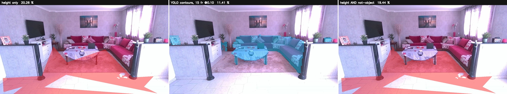

# Calibrage de la caméra et mise en place du stand

Ce guide couvre le placement correct du robot virtuel dans la scène réelle
filmée par le D455, pour les démonstrations sur stand Intel.

## Principe

Le robot est composé par-dessus l'image caméra. Pour qu'il paraisse posé au
sol à la bonne taille, la caméra virtuelle de MuJoCo doit reproduire la
géométrie de la caméra réelle : même champ de vision, même hauteur, même
inclinaison. On mesure ces paramètres une fois, on les injecte, c'est réglé.

Deux paramètres sont lus automatiquement du capteur, un seul est mesuré :

- **Champ de vision (FOV)** : lu du SDK. Le D455 connaît sa focale exacte.
- **Inclinaison (pitch)** : lue de l'IMU. Au repos, l'accéléromètre mesure la
  gravité, ce qui donne l'angle directement. Plus précis qu'un rapporteur.
- **Hauteur caméra** : la seule mesure physique, au mètre ou au laser.

## Mise en place recommandée (stand)

- **Hauteur caméra : 1,5 m**, à hauteur des yeux. Les visiteurs sont filmés à
  leur niveau, et le robot d'1,3 m se pose de façon crédible.
- **Caméra horizontale** ou très légèrement inclinée (2 à 5 deg). Moins
  d'inclinaison = placement plus robuste.
- **Sol dégagé** sur 3 à 4 m devant la caméra. C'est cette bande de sol visible
  qui vend l'illusion "le robot est dans la pièce".
- **Fixation rigide** au stand plutôt qu'un trépied dans le passage. Si la
  caméra bouge, l'inclinaison change et il faut recalibrer.
- **Éviter les contre-jours** : oriente la caméra vers un mur du stand, pas vers
  un écran LED ou une allée passante, sinon la détection souffre.

## Zone morte et patrouille

Devant la caméra se trouve une **zone morte non passante** où le robot ne va
pas : trop proche, il déborderait du cadre, et le sol n'y est pas visible.

À hauteur caméra 1,5 m, le sol n'apparaît dans l'image qu'à partir d'environ
**2,7 m**. C'est la distance minimale de patrouille par défaut
(`PATROL_MIN_DISTANCE=2.7`). Le robot patrouille de 2,7 m à
2,7 + `PATROL_LEG_M` (2,5 m par défaut), soit jusqu'à ~5,2 m, puis fait
demi-tour sans jamais entrer dans la zone morte.

Cette zone tombe bien : c'est aussi l'espace où les visiteurs se tiennent pour
être filmés. Les gens devant, le robot qui patrouille juste derrière eux.

Si tu changes la hauteur caméra, adapte `PATROL_MIN_DISTANCE` :

| Hauteur caméra | Sol visible à partir de | PATROL_MIN_DISTANCE conseillé |
|----------------|-------------------------|-------------------------------|
| 1,2 m          | ~2,2 m                  | 2.2                           |
| 1,5 m          | ~2,7 m                  | 2.7 (défaut)                  |
| 1,8 m          | ~3,3 m                  | 3.3                           |
| 2,0 m          | ~3,6 m                  | 3.6                           |

## Procédure de calibrage

1. Installe la caméra à sa position définitive et mesure sa hauteur au sol.

2. Caméra immobile, lance le calibrage :
   ```bash
   make calibrate HEIGHT=1.50
   ```
   Ou directement, avec le numéro de série :
   ```bash
   python3 /app/calibrate.py --height 1.50 --serial 220422301817
   ```
   Cela lit le FOV (SDK) et l'inclinaison (IMU), et écrit
   `config/camera_calibration.json`.

3. (Optionnel, pour le white paper) Vérifie l'échelle avec un objet de taille
   connue à distance connue, mesurée au laser :
   ```bash
   python3 /app/calibrate.py --height 1.50 --ref-distance 3.0 --ref-height 1.0
   ```
   L'outil indique quel pourcentage de l'image l'objet devrait occuper. Compare
   à l'image réelle pour valider.

4. Sans IMU (repli), saisis l'inclinaison à la main :
   ```bash
   python3 /app/calibrate.py --height 1.50 --manual-pitch -3
   ```

5. Lance la démo. Le viewer charge la calibration automatiquement :
   ```bash
   make run BACKDROP=1 STREAMS=d455 POLICY=rl ROBOT=g1_walker
   ```
   Vérifie dans les logs la ligne `calibration: vfov=... pitch=... height=...`.

## Réglage fin

Si le robot n'est pas parfaitement posé après calibrage, ajuste ces variables :

- `PATROL_MIN_DISTANCE` : borne côté caméra (zone morte).
- `PATROL_LEG_M` : longueur de la zone de patrouille.
- `LOOK_AT_DROP` : hauteur visée par la caméra virtuelle (baisse pour montrer
  plus de sol devant les pieds).
- `CAM_AZIMUTH` : angle de vue du robot (90 = de dos par défaut).

Recalibre en 30 secondes si la caméra est déplacée : `make calibrate HEIGHT=...`.

## Occlusion par profondeur

Le robot est masqué par les objets réels plus proches que lui. Un visiteur qui
passe entre la caméra et le robot cache le robot, au lieu que le robot soit
dessiné par-dessus. C'est ce qui rend la fusion crédible quand des gens
circulent devant.

Comment ça marche : la profondeur du D455 (distance réelle par pixel) est
comparée à la profondeur du robot rendue par MuJoCo (distance virtuelle par
pixel). Un pixel robot n'est dessiné que s'il est plus proche que la scène
réelle à cet endroit.

Réglages :

- `OCCLUSION=1` (défaut) : active l'occlusion. Mettre `0` pour revenir au robot
  toujours au premier plan (repli si la profondeur pose problème).
- `DEPTH_SMOOTH_PX=5` : lissage de la carte de profondeur réelle. La profondeur
  du D455 est bruitée ; augmenter si les bords du robot scintillent, diminuer
  pour des contours plus francs.

Point important : l'occlusion dépend d'une **bonne calibration**. Les deux
profondeurs doivent être dans le même repère métrique, ce qui suppose que la
caméra virtuelle est bien alignée sur la réelle. Si l'occlusion coupe le robot
au mauvais endroit, recalibre d'abord (`make calibrate HEIGHT=...`).

Les zones sans mesure de profondeur (trous, 0) sont traitées comme
infiniment loin, donc elles ne masquent jamais le robot par erreur.

## Le masque de sol : hauteur ET pas-un-objet

`make calibrate` combine desormais **deux** methodes au lieu d'en choisir une.
Un pixel est **sol** quand il passe le seuil de hauteur **ET** qu'il n'est
dans aucune silhouette detectee par YOLO11m-seg.

C'est la logique d'intersection de l'etape C, appliquee au calibrage :
**geometrie ∩ semantique**. Chacune rattrape la faiblesse de l'autre.

- La **hauteur propose** le sol et attrape ce qui n'a pas de classe COCO :
  pieds de tabouret fins, le mat.
- **YOLO retranche** ce qu'il reconnait, par sa **forme reelle**. Il ne peut
  qu'**enlever** du sol, jamais en ajouter : il n'a pas de classe « sol ».

`CALIB_YOLO_MASK=0` revient au seuil de hauteur seul. Le mode combine est le
defaut parce qu'il mesure mieux, plus bas.

### Contours, jamais les boites

Mesure sur cette scene : boite du canape 546x294 px, silhouette 7,47 % de
l'image, soit **mask/box ≈ 38 %** -- le rectangle est aux deux tiers vide et il
avale la table basse presque entierement. Les deux **contours**, eux, ne se
touchent pas. Retrancher des boites enleverait donc le sol de la table en meme
temps que celui du canape, et beaucoup de sol reel avec.

Le fallback « boites » qu'une premiere version utilisait quand un filtre de
classes etait donne a ete supprime : `seg_test.py` filtre maintenant les
**silhouettes par detection**, via `Detector(keep_masks=True)`, un drapeau
additif qui ne change rien au service temps reel.

### Seuil de confiance propre au calibrage

`CALIB_YOLO_CONF`, defaut **0,10**, bien en dessous du seuil d'execution.
L'asymetrie le justifie : ici un faux positif ne fait qu'enlever du sol, et se
repare d'un FILL manuel, tandis qu'un faux negatif laisse un meuble declare
praticable. Mesure : la table basse sort a **0,11 / 0,15 / 0,20**
(min/med/max) -- elle serait perdue au seuil d'execution.

### Union sur plusieurs trames

`CALIB_YOLO_FRAMES`, defaut **15**. La camera est fixe, les detections faibles
clignotent. Une passe unique avait une chance sur quatre d'attraper la table ;
sur 15 trames unies elle est vue **15 fois sur 15**.

### Mesure

Une scene de salon, 1280x720, `floor_h_tol` 0,08 m, 15 trames, conf 0,10 :

| | pixels | % de l'image |
|---|---|---|
| sol **avant** (hauteur seule) | 186 748 | **20,26 %** |
| union YOLO (contours) | 105 152 | 11,41 % |
| sol **apres** (hauteur ∩ pas-objet) | 179 121 | **19,44 %** |
| **retire par YOLO** | **7 627** | **4,08 % du sol hauteur-seule** |

Ce que le seuil de hauteur **seul** declarait sol a l'interieur de chaque objet :

| classe | px sol | part de sa silhouette | conf. med | vue |
|---|---|---|---|---|
| **dining_table** | **7 018** | **25,4 %** | 0,147 | 15/15 trames |
| couch | 707 | 1,0 % | 0,917 | 15/15 |
| chair | 226 | 10,7 % | 0,115 | 3/15 |
| laptop | 0 | 0,0 % | 0,101 | 1/15 |
| book | 0 | 0,0 % | 0,130 | 36 det. |

**Un quart de la table basse etait declare sol praticable.** Le canape, lui,
n'en avait que 1 % : 40 cm de haut echouent au test `|hauteur| < 8 cm` tout
seuls. L'apport est donc concentre sur l'objet **bas** -- la table represente
7 018 des 7 627 pixels retires, soit 92 % du gain -- ce qui est exactement
l'argument : le seuil de hauteur se trompe sur les objets bas, la semantique
non.



A gauche le rouge deborde sur le plateau de la table ; a droite il n'y est plus.

FILL et ERASE manuels restent disponibles pour le residu, et le masque
s'applique a la couche **automatique** seulement :

```python
auto = auto & ~furniture          # semantique
mask = (auto | ui.add) & ~ui.rem  # l'operateur a le dernier mot
```

### Ceci est le masque de CALIBRAGE

Distinct du correctif contour-vs-boite du compositeur en temps reel. Les deux
chemins restent separes : celui-ci tourne une fois, hors ligne, sur une camera
immobile, et peut se permettre 15 trames et un seuil de 0,10 ; l'autre tourne
a 30 Hz.

### Trois etapes, et pourquoi

Aucune image ne peut faire les trois travaux : seul `source` a le droit
d'ouvrir la camera, seul `perception` embarque OpenVINO et le modele, et
l'interface de calibrage doit etre du cote camera.

```
source      calibrate.py --dump-frame /data/calib-frame.png --dump-count 15
perception  seg_test.py --images '/data/calib-frame-*.png' --mask-out ...
source      calibrate.py --height H --furniture-mask /data/calib-furniture.png
```

**Ce n'est pas un second chemin d'inference** : `seg_test.py` construit le meme
`Detector` sur les memes poids que le service `perception`.
