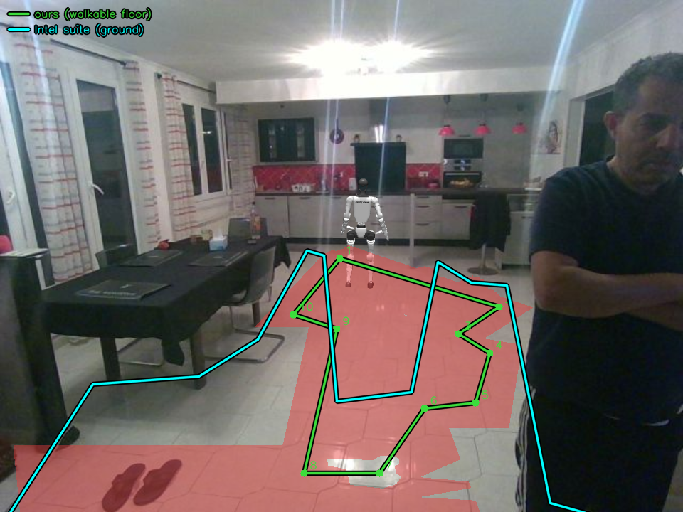
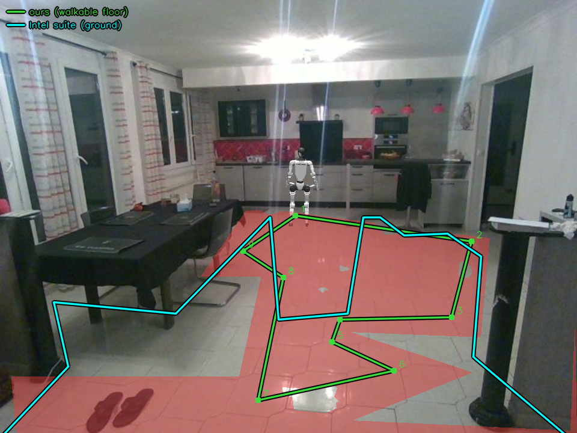

# Étape B — résultats de la mesure

Comparaison entre la détection de sol de ce projet et le nœud
`pointcloud_groundfloor_segmentation` de l'Intel Robotics AI Suite, sur le même
flux de profondeur, en direct.

**Conclusion : le critère est atteint, définitions neutralisées.**
IoU médiane **0,530** (seuil 0,5) et frontière médiane **0,164 m** (seuil
0,20 m). Les deux détections voient le même sol.

---

## 1. Le critère

Étape B pose une question de perception : *leur segmentation voit-elle le même
sol que la nôtre, et que coûte l'aller-retour ?*

| grandeur | seuil |
|---|---|
| IoU sol contre sol | > 0,50 |
| distance médiane des frontières | < 0,20 m |
| latence ajoutée | < 50 ms |

**Ce que le critère n'est pas.** La première campagne comparait les *empreintes
d'obstacles* et donnait 0,0 d'appariement sur 478 comparaisons. C'était une
mesure de la mauvaise chose : les empreintes sont un produit dérivé, leur nœud
fusionne agressivement, et une IoU d'empreintes est diluée dès qu'un côté
fusionne — même quand les deux sont d'accord sur l'emplacement des objets. Voir
`36de12c`.

## 2. Méthode

- Leur produit primaire est `/segmentation/labeled_points`. `obstacle_points`
  n'en est qu'une vue filtrée, et **le sol n'est accessible que là**.
- La classe du sol a été **mesurée, pas lue dans une config** : sur 1,5 M de
  points, la classe `3` est à z médian **+0,060 m** avec un écart type de
  0,094 m ; toutes les autres classes sont à 0,77 m ou plus.
- Le pont extrait la classe sol, la projette au plan du monde et publie un
  contour sur `groundfloor.floor`, à côté du nôtre.
- `suite_compare.py` rastérise les deux polygones sur une grille commune à 5 cm
  et calcule l'IoU plus une distance de frontière **symétrique**, rapportée en
  distribution et non en moyenne : une moyenne masquerait un sol qui dépasse
  l'autre de plusieurs mètres sur un seul mur.
- Le rastérisage plutôt que la géométrie analytique, pour la raison que donne
  `shrink()` : les opérations polygonales sont instables sur les angles
  rentrants, que les deux contours possèdent.

### Correctifs nécessaires avant toute mesure

1. **QoS** (`fed42a8`). Leur nœud s'abonnait en `RELIABLE`, notre pont publie en
   `BEST_EFFORT` comme le ferait un vrai pilote de caméra. DDS refusait
   d'apparier : *« no messages will be sent »*, puis 30 s de silence. Corrigé
   par `use_best_effort_qos:=True` au lancement, sans toucher au QoS du pont.
2. **Retours impossibles** (`36de12c`). z descendait à **−6,096 m** sous un sol
   à 0, et x montait à **14,378 m** dans une pièce dont le mur du fond est à
   6,2 m. Environ 2,6 % des points. Une médiane les ignore, mais une boîte
   englobante est un maximum : un seul suffisait à étirer une empreinte à
   travers la pièce. Écartés avant toute construction (`GF_Z_MIN`, `GF_X_MAX`).
   Les points **au-dessus** du robot sont volontairement conservés : une
   étagère ou un plafond bas est un obstacle réel, et ce jugement appartient au
   navigateur.

La TF a été vérifiée par la mesure et **n'est pas en cause** : intersection au
sol à **+6,22 m** pour +6,2 m attendus, axe optique à +14,08° sous
l'horizontale, conforme à la calibration.

## 3. Le réglage `max_surface_height`

Leur nœud n'acceptait comme sol que ce qui se trouvait à moins de 0,05 m de son
plan estimé. Or leur propre classe sol est à z médian **+0,060 m** : le seuil
tombait **sous la médiane du sol qu'il devait accepter** et en écartait plus de
la moitié. Porté à **0,08 m**, la valeur de `floor_h_tol_m` de notre
calibration, pour que les deux détections tolèrent le même écart au plan.

Fichier de paramètres monté (`services/groundfloor/params/`) plutôt que cuit
dans l'image : tourner un bouton ne doit pas coûter une reconstruction de
4,8 Go.

| | **0,05** (défaut) | **0,08** |
|---|---|---|
| IoU sol (médiane) | 0,107 | **0,307** |
| notre surface | 7,88 m² | 8,08 m² |
| leur surface | 4,36 m² | **9,33 m²** |
| frontière médiane | 0,430 m | **0,328 m** |
| frontière p95 | 1,790 m | **1,082 m** |
| points sol / trame | ~25 k | **~61 k** |
| leurs empreintes | 1,8 | 6,1 |

Leur surface a été multipliée par 2,14 et **dépasse** la nôtre au lieu de
converger vers elle. Effet secondaire notable : accepter plus de sol a cassé la
fusion en un bloc unique, et les empreintes appariées sont devenues mesurables
pour la première fois.

## 4. Résultat final, définitions neutralisées

`roi` est une **politique** — où le robot *a le droit* de marcher : sol détecté,
moins les silhouettes, moins les empreintes, puis rétréci de `ROI_MARGIN`
(0,25 m). Le comparer à leur segmentation mesure nos choix autant que leur
détecteur.

`raw` est la **perception** seule : le sol tel que la géométrie de profondeur le
rapporte, sans aucun des trois. Publié sur `patrol.roi`, personne ne s'en sert
pour piloter.

Mesure sur 120 s, 694 comparaisons, `max_surface_height = 0.08` :

| | `roi` (politique) | **`raw` (neutralisé)** |
|---|---|---|
| **IoU médiane** | 0,315 | **0,530** ✅ |
| IoU min / max | 0,035 / 0,464 | 0,316 / 0,685 |
| notre surface | 8,29 m² | 14,17 m² |
| leur surface | 9,33 m² | 9,33 m² |
| **frontière médiane** | 0,328 m | **0,164 m** ✅ |
| frontière p95 | 1,025 m | 0,947 m |
| frontière max | 1,450 m | 1,396 m |
| nous → eux | 0,239 m | 0,143 m |
| eux → nous | 0,382 m | 0,185 m |

Les deux seuils sont franchis. L'IoU passe de 0,315 à 0,530 et la frontière
médiane est divisée par deux, **uniquement en retirant nos propres définitions**
de la comparaison — la perception sous-jacente n'a pas changé.

## 5. Les deux sols superposés

Contour vert : le nôtre (`roi`, sol praticable). Contour cyan : le leur (classe
sol de `labeled_points`). Les deux passent par **la même** projection
`_world_to_pixel`, donc un écart visible vient des deux détections et non de
deux façons de dessiner un polygone. Le rouge est la superposition de sol
existante de la touche `f`.



Pièce occupée. Au centre les deux contours se suivent de près — c'est la zone
« both » de 4,3 m². Le cyan déborde nettement vers la gauche et vers la droite,
au-delà de ce que le vert retient.



Pièce vide, le désaccord de champ proche est le plus lisible : le cyan balaie
tout l'avant-plan gauche, passe sous la table et contourne la colonne de droite,
là où le vert s'arrête bien avant. C'est le §6.2 ci-dessous — leur sol commence
à 1,30 m, le nôtre à 1,7 m après `ROI_MARGIN`. Vers le fond, à l'inverse, le
vert monte vers la cuisine plus loin que le cyan (§6.1).

Ces images ont été produites avec `DIAG_FRAMES=5 SHOW_FLOOR=1` (voir §9), puis
les deux réglages remis à zéro.

## 6. Les trois désaccords résiduels

Analysés sur 633 paires de polygones (~190 s). Le désaccord est **en
profondeur, pas latéral** : la bande centrale (−1,5 à +1,5 m) contient 3,57 des
3,64 m² « nous seulement » et 4,22 des 4,82 m² « eux seulement ».

**1. Champ lointain tronqué chez eux.** Leur sol s'arrête à ~5,45 m ; le nôtre
atteint 6,1 à 7,4 m. 2,47 des 3,64 m² « nous seulement » sont au-delà de
x > 4 m. L'erreur de profondeur d'une RealSense croît en gros comme le carré de
la distance : à 5–6 m le bruit sur le plan de sol dépasse même le seuil relevé à
0,08 m, et ces points cessent d'être classés sol. C'est aussi pourquoi passer de
0,05 à 0,08 a récupéré autant de surface — le champ moyen est revenu, le champ
lointain demanderait davantage.

**2. Champ proche plus généreux chez eux.** Leur sol commence à **1,30 m**, le
nôtre à 1,5 m brut et 1,7 m après marge. 3,71 des 4,82 m² « eux seulement » sont
en deçà de x < 3 m. Leur `min_distance_to_ego` vaut 0,4 m. Sur `roi` cet écart
est entièrement le nôtre (`ROI_MARGIN`), ce que la neutralisation supprime ; sur
`raw` il en reste la différence de portée minimale.

**3. Nature de la décision.** Notre sol est une **géométrie de plan** appliquée à
toute la région visible ; le leur est une **classification point par point**
contre un plan estimé. D'où 14,17 m² contre 9,33 m² : ils rejettent du sol que
notre géométrie accepte, notamment là où la surface est sombre, brillante ou
rasante. Les deux sont défendables ; ils ne mesurent pas la même chose.

**Décalage de plan de +0,06 m, non expliqué.** Leur classe sol est centrée à
+0,060 m et non à 0, de façon stable et serrée (σ = 0,094 m sur 1,5 M de
points) — plus compatible avec un biais systématique d'ajustement de plan
qu'avec du bruit. **Leur nœud ne journalise rien sur son estimation de plan** :
aucune ligne contenant `plane`, `ransac`, `inlier`, `estimat` ou `surface`. La
TF étant vérifiée correcte, ce n'est pas la transformation statique. Trancher
demanderait d'instrumenter leur nœud, ou d'ajuster nous-mêmes un plan sur leurs
points de sol.

## 7. Latence — avec réserve

Sur 41 échantillons, 120 s :

| min | médiane | p95 | max | moyenne |
|---|---|---|---|---|
| 28 ms | 41 ms | 49 ms | 52 ms | 39,4 ms |

Médiane et p95 sont sous la cible de 50 ms, **mais sur des entrées déjà
agrégées** : chaque valeur est le chiffre que le pont imprime une fois par
intervalle de report, pas un aller-retour de trame. La dispersion réelle par
trame est plus large et n'est pas observable en l'état. **La cible n'est donc
pas démontrée atteinte**, seulement compatible avec la mesure disponible.

Autre chiffre à garder en tête : leur nœud consomme environ **une trame sur
trois** (277 trames de profondeur entrantes pour 91 segmentations sur 30 s,
~9 Hz contre ~3 Hz). Stable, cohérent avec `BEST_EFFORT` et une file de
profondeur 2 ; ce n'est pas une perte erratique, mais la suite ne voit qu'un
tiers de ce que la caméra produit.

## 8. Défauts connus

**a. La latence par trame n'est pas instrumentée — toujours ouvert.**
`bridge.py` conserve un seul `_latency` écrasé à chaque aller-retour et n'en
imprime la valeur qu'une fois par intervalle. Tout le §7 en dérive. Corriger
demande d'accumuler les allers-retours individuels et d'en publier la
distribution ; tant que ce n'est pas fait, aucun p95 par trame n'est disponible.

**b. `_write_diagnostics` était du code mort — corrigé.** Le bloc
`if frames in DIAG_FRAMES:` se trouvait **à l'intérieur du gestionnaire
`except`, après le `raise`** : inatteignable, et `DIAG_FRAMES` (alors la liste
30, 120, 300, 600, 900, 1200) n'avait jamais rien écrit. Désindenté, et
**verrouillé** au passage, parce que le remettre en route sans garde aurait
rempli `/data` de PNG pleine taille à chaque démonstration :

- `DIAG_FRAMES` est désormais un **nombre**, plus une liste de numéros de trame :
  le compositeur écrit ce nombre d'images puis s'arrête définitivement.
- **0 par défaut**, donc rien ne s'écrit sans demande explicite.
- Seules les trames **annotées** sont retenues : une trame sans superposition
  est le composite que la fenêtre affiche déjà, et attendre l'annotation laisse
  aux contours le temps d'apparaître.

Les figures du §5 ont été produites ainsi. À noter, observé en les capturant :
sur cinq trames consécutives au démarrage, deux seulement portaient les **deux**
contours — `roi_cached` est reconstruit à chaque changement de détections et
reste vide un instant, pendant lequel seul le cyan est présent. Ce n'est pas un
défaut de la superposition, mais il faut le savoir avant de capturer.

## 9. Reproduire

```bash
make                                     # la démo
make groundfloor                         # le pont ROS 2, profil suite
make suite-compare ARGS="--seconds 120"  # les deux, plus le brut neutralisé
```

Dans la fenêtre du compositeur, `f` superpose les deux contours : le nôtre en
vert, le leur en cyan, avec une légende.

`max_surface_height` se règle dans
`services/groundfloor/params/groundfloor_segmentation_params.yaml` (monté, pas
cuit dans l'image) ; il suffit de redémarrer `groundfloor`.

Pour refaire les figures du §5, `groundfloor` devant déjà tourner :

```bash
DIAG_FRAMES=5 SHOW_FLOOR=1 docker compose up -d --force-recreate compositor
ls data/composite_frame_*.png
docker compose up -d --force-recreate compositor   # remet les deux a zero
```

`DIAG_FRAMES` est un **nombre** d'images, pas une liste de numéros de trame, et
les deux réglages valent 0 par défaut. Le compositeur s'arrête définitivement
après ce nombre d'images ; garder plus d'une ou deux trames avec les **deux**
contours demande souvent deux passes (voir §8b).

> Modifier `common/` invalide toutes les images de service, et `suite-compare`
> ne reconstruit rien. Reconstruire `perception` et `compositor` à la main après
> l'ajout d'un topic.
