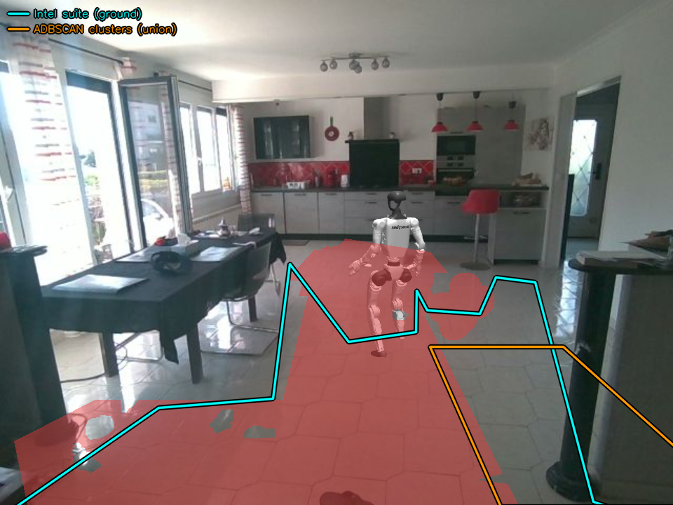

# Étape C — résultats de la mesure (ADBSCAN)

> **Étape gelée ici.** L'architecture est décidée et mesurée, le test
> d'acceptation passe, et le coût résiduel est nommé au §8 avec ses pistes.
> Ce qui suit est un compte rendu, pas un chantier en cours.

Comparaison entre les empreintes d'obstacles de ce projet et les clusters du
nœud `adbscan_ros2` de l'Intel Robotics AI Suite, sur le même flux de
profondeur, en direct.

**Conclusion : la substitution échoue, la composition marche, et l'architecture
recommandée est l'union des deux.** Branché tel quel, ADBSCAN rend un amas
unique de la taille de l'arène dans 60 % des trames — donner ça au navigateur
ne lui laisse nulle part où marcher. Une fois les trois milieux de chaînage
retirés, le taux d'appariement passe de 16 % à **39–42 %** avec un recouvrement
de paires de **0,50**. Ce qui reste n'est pas du désaccord réparable : les deux
détecteurs voient des choses différentes, et chacun voit ce que l'autre rate.

> **Lire les chiffres dans leur session.** Comme au §7 d'`ETAPE-B-RESULTS.md`,
> la couverture de sol de leur nœud dérive d'une session à l'autre et entraîne
> tout ce qui en descend. Les comparaisons ci-dessous sont **toujours** faites
> entre passes d'une même session, avec l'IoU du sol brut comme témoin — ce
> témoin ne peut être atteint par aucun réglage d'ADBSCAN, donc un sol stable
> prouve que la scène n'a pas bougé sous la mesure. Un taux d'appariement d'une
> section ne se compare pas à celui d'une autre : le 35 % du §4b et le 16 % du
> §4c sont des sessions différentes, pas une régression.

---

## 1. Le critère

`ROADMAP.md` posait : *le robot évite les mêmes obstacles qu'aujourd'hui, avec
les obstacles venant de chez eux.* C'est un critère de **substitution**, et la
mesure le rejette. Il est remplacé au §8.

La bonne cible de comparaison, elle, est acquise : ADBSCAN produit des clusters
d'obstacles et nous des empreintes, les deux répondent à « quelque chose est là,
gros comme ça ». L'étape B comparait nos empreintes au produit dérivé d'un
segmenteur de sol, ce qui mesurait des définitions plutôt que de la perception.

Tout est noté par `match()` de `scripts/suite_compare.py` : appariement 1-1 par
IoU, seuil 0,3, les deux jeux rognés à la même arène (x 1,5–6,5 m, y −2,6 à
1,5 m) avant appariement.

## 2. Architecture : chaîner les briques

ADBSCAN enlève le sol avec **un seul seuil de hauteur**, `z_filter`, appliqué
dans le repère qu'on lui donne. Cela marche sur leur robot AAEON, caméra de
niveau. Ici la caméra est piquée de 14,08° et dans un repère centré caméra le
sol **rampe** :

| x monde | z | x monde | z |
|---|---|---|---|
| 1,5 m | −1,148 | 4,5 m | −0,418 |
| 3,0 m | −0,783 | 6,5 m | +0,068 |

1,22 m d'amplitude sur l'arène, soit `x·tan(14,08°)`. Aucun seuil constant ne
coupe ça : la valeur qui dégage le sol proche garde le sol lointain, et le sol
lointain est une nappe connexe — c'est exactement le cluster de 6,14 × 6,22 m
qu'ADBSCAN rendait sur le nuage brut.

La réponse est la composition, que la suite prévoit elle-même : `groundfloor`
enlève le sol avec un ajustement de plan conscient de l'inclinaison et publie le
reste sur `/segmentation/obstacle_points`, déjà en `base_link`. ADBSCAN
regroupe ensuite des points dont on sait qu'ils ne sont pas le sol.

Deux conséquences de forme, toutes deux gagnantes :

- **`Lidar_type: 3D`, pas `RS`.** Le chemin RS tourne chaque point par
  `(x,y,z) <- (z,-x,-y)`, l'échange optique-vers-corps, car il attend un nuage
  RealSense brut dans le repère optique. La sortie de `groundfloor` est **déjà**
  en `base_link`, donc RS la brouillerait. `3D` prend le nuage tel quel.
- **`base_link` est le repère monde de ce projet par construction** (origine au
  sol sous la caméra, x avant, y gauche, z haut). Les positions de clusters
  reviennent donc sans aucune transformation. La rotation de tangage et le
  relèvement de hauteur qu'il fallait sur le chemin RS ont disparu avec.

Un seul producteur par topic : le conteneur `groundfloor` possède le chemin de
profondeur — image, `camera_info`, TF — et le conteneur `adbscan` n'en publie
aucun. `depends_on` et `make adbscan` imposent l'ordre.

## 3. La QoS, ce non-problème

L'étape B avait perdu 30 s de silence sur une QoS dépareillée, donc c'était le
piège attendu. Il n'a pas mordu, pour une raison qu'il vaut la peine d'écrire :
**il n'y a pas de `use_best_effort_qos` à passer, et il n'en existe pas.**
`adbscan_sub` souscrit avec `rclcpp::SensorDataQoS()` inconditionnellement, donc
déjà `BEST_EFFORT`, ce que `groundfloor` publie déjà pour son nuage d'obstacles.
Les deux bouts s'accordaient sans rien faire.

Le seul endroit qui a demandé de l'attention est **l'inverse** : leur publieur
d'`ObstacleArray` est un `rclcpp::QoS(1)` nu, donc `RELIABLE`, et la
souscription du pont doit l'être aussi. Et le saut ajouté au §4b garde les
sémantiques de capteur du topic au milieu duquel il s'insère : `BEST_EFFORT`
des deux côtés, profondeur 2. Un nuage perdu vaut mieux qu'un nuage en retard.

## 4. Trois milieux de chaînage, retirés un par un

DBSCAN enchaîne **par contact**. Tout ce qui touche deux objets les fusionne, et
il n'a pas fallu une cause mais trois, découvertes dans cet ordre.

### 4a. Le sol lointain — retiré en chaînant derrière `groundfloor`

C'est le §2. Prédiction : l'amas disparaît, le nombre de clusters monte,
l'appariement s'améliore. **Seule la première moitié de la première partie s'est
produite.** Les rectangles hors arène tombent de 0,9 à 0,2 par trame — la nappe
de sol lointain a bien disparu — mais un cluster de **6,51 × 7,88 m** est
toujours là. Murs, meubles et plafond, que `groundfloor` étiquette non-sol, sont
eux-mêmes une seule masse connexe. Appariement : **2 %**.

### 4b. Les murs — retirés en rognant le nuage à l'arène

`groundfloor` enlève le sol, pas les murs. Le mur du fond et les murs latéraux
survivent dans `obstacle_points` comme de grandes nappes connexes, et une chaise
contre le mur n'est plus une chaise : c'est un bloc avec le mur et la moitié de
la pièce.

`services/adbscan/bridge.py` s'insère donc **dans** le chemin du nuage : il lit
`/segmentation/obstacle_points`, coupe à l'intérieur de l'arène et republie sur
`/segmentation/arena_points`, que leur nœud consomme. Couper **avant** leur nœud
et non jeter les clusters après : après, le mal est fait, la chaise est déjà
dans la masse fusionnée.

Les bornes (x 1,2–6,3, y −2,8 à 1,7) sont volontairement **plus larges** que
l'arène de comparaison, sans quoi l'étendue des clusters notés serait un
artefact du filtre et non de leur détecteur.

Mesuré sur une scène, 60 s, contre les deux passes non rognées de la même
session (témoin : IoU du sol brut 0,646 / 0,658 / 0,657 non rogné, 0,672 après) :

| | non rogné | rogné |
|---|---|---|
| clusters dans l'arène | 1,4 / 1,6 | **2,2** |
| appariés | 0,8 / 0,9 | **1,1** |
| recouvrement des paires | 0,32 / 0,32 | **0,39** |
| taux d'appariement | 27 % / 28 % | **35 %** |
| étage ADBSCAN | ~27 ms | **~2,9 ms** |

59 % des points conservés. Les clusters qui reviennent sont ceux que les murs
avalaient, et le recouvrement qui monte dit que les survivants s'accordent mieux
en forme, pas seulement qu'ils sont plus nombreux. L'effondrement du coût retire
aussi l'objection notée contre `subsample_ratio: 75` : le facteur 4 était la
nappe murale, pas le nombre de points.

**Non réglé à ce stade :** « eux seulement » monte de 0,6–0,7 à 1,1. Fragments
de ce que les murs absorbaient, ou vrais obstacles sans empreinte chez nous —
ces chiffres ne savent pas séparer les deux. Le §7 y répond.

### 4c. Le résidu du plan estimé — la vraie cause

Après 4a et 4b, un amas de la taille de l'arène persiste dans **60 %** des
trames. Ce n'était donc ni le sol lointain ni les murs. La carte des non
appariés (§7) a nommé le symptôme ; l'histogramme a nommé la cause.

**Histogramme de z** (hauteur au-dessus du sol, `base_link`) du nuage
qu'ADBSCAN reçoit réellement, `/segmentation/arena_points`, 40 nuages :

| bande de z | % du nuage |
|---|---|
| −0,30 à 0,00 | 7,5 % |
| 0,00 à 0,08 | 2,9 % |
| **0,08 à 0,12** | **3,8 %** |
| 0,12 à 0,30 | 10,8 % |
| 0,30 à 1,50 | 62,4 % |

Il y a bien une bande basse, et elle **culmine à 0,10–0,14 m** : le plus haut
casier sous 0,50 m, juste au-dessus de la coupe. C'est la signature d'un
ajustement de plan point par point qui laisse une dispersion **posée sur** le
sol plutôt que de faire une coupe nette.

3,8 % semblait trop mince pour compter, d'où une seconde mesure avant d'écrire
le moindre filtre. L'arène est quadrillée en cellules de 10 cm, les points
sous-échantillonnés 1 sur 75 exactement comme leur nœud le fait :

| bande | pts/nuage | cellules | **cellules sans rien au-dessus de 0,30 m** |
|---|---|---|---|
| 0,08–0,12 | 45 | 38 | **71 %** |
| 0,08–0,20 | 111 | 68 | 61 % |
| > 0,30 | 845 | 309 | — |

La dernière colonne est celle qui tranche. Un meuble garde sa masse en hauteur ;
un retour bas **sans corps au-dessus de lui** n'est pas un pied de meuble, c'est
du sol que l'ajustement de plan n'a pas réclamé. 38 cellules dispersées par
nuage, ce n'est pas un tapis — c'est assez de pierres de gué pour traverser une
pièce, et DBSCAN enchaîne par contact.

**`GF_Z_LOW` (0,12 m, compose fait foi)** retire `0 < z < GF_Z_LOW` dans la même
passe que le rectangle d'arène. Deux détails de conception :

- La bande est **ouverte aux deux bouts** et son bas est **0, pas −∞**. Les
  points *sous* le sol sont gardés exprès : un cluster centré sous le sol tombe
  dans le filtre « retour impossible » du pont, et cette chute est le signal que
  l'ajustement de plan dérape. Les couper ici masquerait le signal.
- **Leur nœud coupe déjà sous 0,08 m** lui-même (`z_filter` avec
  `Z_based_ground_removal`, `doDBSCAN.cpp:304`, branche 3D). La tranche que ce
  filtre retire réellement est donc **0,08 à 0,12** : 45 des 1011 points par
  nuage qui atteignent le regroupement, 4,5 %.

Deux passes de 60 s contre les deux qui précèdent le filtre, même session :

| | avant | après |
|---|---|---|
| taux d'appariement | 16 % | **39 % / 42 %** |
| recouvrement des paires | 0,46 | **0,50** |
| clusters par trame | 1,8 | 2,8 |
| amas large de l'arène, persistance | **60 %** | **11 % / 14 %** |
| table à manger, « nous seulement » | 41 + 29 % | 10–12 % |
| étage ADBSCAN | ~2,9 ms | ~2–3 ms |

Témoin : IoU du sol brut 0,555 / 0,552 / 0,547 / 0,530 sur les quatre passes. Ce
filtre ne peut pas atteindre le nœud `groundfloor`, donc la scène a tenu et
l'écart est bien le filtre.

**4,5 % des points valent 23 points de taux d'appariement.** C'est le résultat
le plus utile de l'étape C, et il ne se serait pas vu sans l'histogramme : les
compteurs par trame disaient « un amas », pas « posé sur du sol mal classé ».

## 5. `subsample_ratio`, le seul paramètre d'algorithme modifié

`subsample_LiDAR_data` est une **foulée**, pas une fraction : elle garde un
point sur `ratio`. Leur 150 est dimensionné pour un nuage RealSense brut ; notre
entrée est ce qui **reste** après retrait du sol, une petite fraction de ce
nuage. 75 double donc les points atteignant le regroupement.

Mesuré 75 / 150 / 75 dans cet ordre, trois passes de 60 s sur une scène (témoin
sol : 0,646 / 0,658 / 0,657) :

| | 75 | 150 | 75 |
|---|---|---|---|
| clusters dans l'arène | 1,4 | 1,9 | 1,6 |
| appariés | 0,8 | 0,8 | 0,9 |
| eux seulement | 0,6 | 1,1 | 0,7 |
| taux d'appariement | 27 % | 28 % | 28 % |

Plus de points ne trouvent **pas** plus d'objets : la densité supplémentaire
FUSIONNE des clusters. Le compte baisse d'un cinquième et toute la baisse est
dans « eux seulement » pendant que « appariés » reste plat — la signature d'un
cluster parasite absorbé par un voisin déjà apparié. Gardé à 75. Tous les autres
paramètres d'algorithme (`base`, `coeff_1`, `coeff_2`, `scale_factor`) sont
exactement ceux d'`adbscan_sub_RS.yaml` et n'ont jamais été touchés.

## 6. `x_filter_back` et `y_filter_*` ne s'exécutent pas

Trouvé en lisant leur source pour vérifier la sémantique de `z_filter`. Dans
`doDBSCAN.cpp`, la branche `dimension == 3` — la nôtre — applique le filtre z et
**rien d'autre** : les appels x et y y sont commentés dans leur arbre, et seule
la branche `dimension == 4` (RS) les exécute.

Nos valeurs `x_filter_back: 6.5` et `y_filter_*: ±4.0` documentent donc une
intention, elles ne filtrent rien. Les bornes d'arène sont tenues par
`bridge.py`, et c'est là qu'il faut les changer. `z_filter`, lui, est bien
appliqué. Noté dans `params.yaml.in` pour que le prochain lecteur ne règle pas
un paramètre inerte.

## 7. Nommer le désaccord qui reste

Les compteurs par trame disent **combien** de rectangles personne n'apparie. Ils
ne disent pas si c'est toujours le même objet ou un bruit différent à chaque
trame, et les deux appellent des réponses opposées.
`make suite-compare ARGS="--unmatched"` regroupe les non appariés par
emplacement (regroupement par chef de file sur le centre, rayon 0,5 m) et compte
la **persistance** en trames distinctes.

Le rayon de 0,5 m est sous le plus petit écart entre objets réels de cette pièce
et au-dessus de la gigue image à image des deux détecteurs. Regroupement par
chef de file plutôt que k-moyennes (il faut un k qu'on ignore) ou lien simple
(il enchaîne le long d'un mur — une façon malheureuse de mesurer un détecteur
dont le défaut est d'enchaîner le long d'un mur).

**Avant le filtre de résidu** (60 s, 509 trames, taux 16 %) :

| | persist. | centre | taille | lecture |
|---|---|---|---|---|
| nous | 98 % | 5,80 ; −1,99 | 1,40 × 1,21 | bloc cuisine du fond |
| nous | 41 % | 3,48 ; 1,03 | 2,64 × 0,96 | la table à manger |
| nous | 29 % | 4,44 ; 1,04 | 4,19 × 0,71 | la même, étendue plus loin |
| eux | 60 % | 3,99 ; −0,52 | **5,00 × 4,10** | **toute l'arène** |
| eux | 19 % | 4,58 ; −1,40 | 3,81 × 2,43 | moitié droite |
| eux | 15 % | 4,00 ; −1,37 | 4,99 × 2,52 | moitié droite |
| eux | 14 % | 2,10 ; −1,11 | 1,19 × 1,09 | pilier et comptoir proches |

Cinq de leurs six emplacements dépassent 2,4 m dans une dimension : ce n'est pas
un jeu d'objets, c'est **un amas redécoupé autrement à chaque trame**.

**Le nommage est étayé, pas deviné.** YOLO sur la trame en direct rend
`dining table` à cx 0,235 (gauche du cadre), `chair` à cx 0,712 (le tabouret
rouge de l'îlot) et cx 0,412 (une chaise de la table), `person` au centre. La
boîte de 0,40 m à 40,6° hors axe tombe exactement au bord du champ horizontal de
79°, là où se tient le poteau sombre dans le coin bas droit de l'image. Repère :
+x devant, **+y à gauche**, donc y négatif est la droite de l'image.

**Après le filtre** (deux passes) :

| | persist. | centre | taille | lecture |
|---|---|---|---|---|
| nous | 95–100 % | 5,80 ; −1,99 | 1,40 × 1,21 | bloc cuisine du fond |
| nous | 10–12 % | 4,55 ; 1,00 | 4,19 × 0,71 | reliquat de la table |
| eux | 68–82 % | 4,57 ; −1,48 | 3,8 × 2,2 | la moitié droite en un bloc |
| eux | 70–75 % | 2,00 ; −1,12 | 1,0 × 1,0 | **pilier et comptoir proches** |
| eux | 11–14 % | 4,02 ; −0,52 | 5,00 × 4,10 | l'amas, résiduel |

### L'appariement groupé, résultat négatif

Le taux 1-1 compte comme trois ratés un détecteur qui coupe un objet en trois,
même s'il regarde exactement le même sol. `group_match()` regroupe donc leurs
clusters tombant dans une de nos empreintes et note notre rectangle contre
l'**union** du groupe (`union_iou`, exact par compression de coordonnées : la
somme des aires compterait les recouvrements deux fois et déprimerait le score
précisément là où un détecteur fragmente).

Le groupage doit être une **détente** du 1-1, jamais une autre règle, sinon les
deux blocs ne se comparent pas. Deux garde-fous, trouvés par la mesure et non
par le raisonnement : les groupes sont **amorcés avec les paires de `match()`**
avant d'être étendus par couverture, et un groupe dont l'union note moins que
son meilleur membre seul retombe sur ce membre. Une règle de couverture seule
mettait le taux groupé à 6 % contre 19 % en 1-1 — une détente qui note sous ce
qu'elle détend.

Deux passes de 60 s :

| | par cluster | groupé |
|---|---|---|
| taux | 24 % / 19 % | 24 % / 19 % |
| recouvrement | 0,44 / 0,45 | 0,44 / 0,45 |
| leurs clusters par groupe | — | 1,03 / 1,02 |

**Le groupage ne se déclenche presque jamais.** Il suppose que leurs rectangles
sont plus *petits* que les nôtres, des morceaux à recoller ; ils sont plus
*grands*. Les deux blocs venant de la même passe, la comparaison est interne et
immunisée contre la dérive inter-session. Le désaccord résiduel n'est pas de la
granularité.

### Les deux résidus, et leur cause

- **Eux, 68–82 %, 3,8 × 2,2 m à droite.** Notre bloc cuisine, persistant à
  95–100 %, est *dedans* — mais 1,7 m² dans 8,6 m² ne fait pas 0,3 d'IoU. Il
  reste du chaînage, sur le côté où la cuisine, l'îlot et le comptoir se
  touchent réellement.
- **Eux, 70–75 %, 1,0 × 1,0 m au proche droit.** Compact, stable, et **nous
  n'avons aucune empreinte là**. C'est le poteau sombre et le comptoir. Leur
  test de densité les voit ; notre segmentation sémantique ne les voit pas,
  parce que ce ne sont pas des objets d'une classe COCO. C'est le seul endroit
  où leur détection bat la nôtre — et c'est un obstacle réel, contre lequel le
  robot se cognerait.

Symétriquement, la table à manger et le bloc cuisine sont des objets que **nous**
tenons et qu'ils fondent dans une masse ou ratent.

## 8. Conclusion et critère révisé

**La substitution échoue.** Brancher leurs clusters à la place des nôtres donne
au navigateur un rectangle de 5 × 4 m couvrant l'arène dans 60 % des trames sans
les filtres, et une moitié de pièce en un bloc dans 68–82 % des trames avec. Le
robot n'aurait nulle part où marcher. Le critère de substitution du `ROADMAP` ne
peut pas être atteint par du réglage.

**La composition marche.** Chaînée derrière `groundfloor`, rognée à l'arène et
débarrassée du résidu de plan, leur brique atteint 39–42 % d'appariement à 0,50
de recouvrement, pour ~3 ms.

**L'architecture recommandée est l'union des deux**, parce que les deux
détecteurs sont complémentaires par construction :

- **Nous** partons d'une segmentation sémantique. Nous voyons une table parce
  que c'est une table, avec sa silhouette, et nous la tenons quand elle touche
  un mur.
- **Eux** partent d'un test de densité géométrique. Ils voient un poteau et un
  comptoir sans savoir ce que c'est, là où aucune classe n'existe — et ils les
  tiennent à 70–75 % pendant que nous n'avons rien.

Un obstacle vu par l'un des deux est un obstacle. Le coût d'un faux positif est
un détour ; celui d'un faux négatif est une collision. L'union est donc le bon
opérateur, et pas seulement le compromis diplomatique.

**Critère révisé pour l'étape C**, tel qu'inscrit au `ROADMAP` : *le navigateur
consomme l'union de nos empreintes et de leurs clusters, et le robot évite au
moins les obstacles qu'il évite aujourd'hui, plus le pilier proche droit qu'il
ne voit pas.* C'est vérifiable, ça exploite ce que leur brique apporte
réellement, et ça n'exige pas d'elle une granularité qu'elle n'a pas.

### L'union, implémentée et mesurée

`OBSTACLE_SOURCE=ours|suite|union` dans le navigateur, défaut `ours` : la démo
livrée ne change pas. En `union`, `sim.py` passe aussi `SUITE_CLUSTERS` au
navigateur, qui rogne leurs clusters à l'arène, refuse ceux qui dépassent
`SUITE_MAX_SPAN` (3 m), confirme **chaque source séparément** puis fusionne. La
confirmation par source est nécessaire : un objet qu'un seul détecteur voit —
le pilier est exactement ça — doit pouvoir se confirmer contre son propre
historique, alors que mettre les deux en commun le ferait concourir contre les
mises à jour de l'autre source et il n'atteindrait jamais `CONFIRM_MIN`.

**Le garde-fou de largeur doit survivre à la fusion, sinon il n'existe pas.**
Refuser leur bloc de 3,8 × 2,2 m cluster par cluster ne sert à rien si trois de
leurs clusters de moins de 3 m s'enchaînent ensuite avec un des nôtres et le
reconstruisent. Mesuré : une barrière de 5,3 × 3,8 m étiquetée `ours+suite`,
**43 échappées et 5 « no way round »** sur trois minutes. Le garde-fou est donc
aussi appliqué **pendant** la fusion, et seulement quand une boîte `suite` est
en jeu — nos propres empreintes fusionnent en une barrière de 5,3 × 3,6 m sur
cette scène aussi, et celle-là ne coûte rien parce qu'elle longe le bord au lieu
de traverser la voie.

Quatre passes de ~215 s, même scène (une personne y marche, d'où la variance des
tours) :

| | tours | tours complets | « no way round » | échappées | détours `[suite]` |
|---|---|---|---|---|---|
| `ours` | 13 / 5 | 7 / 2 | **0 / 0** | **1 / 3** | 0 |
| `union`, sans garde-fou de fusion | 20 / 8 | 10 / 4 | **5 / 0** | **43 / 24** | 62 / 18 |
| `union`, avec | 12 / 10 | 6 / 5 | **0 / 0** | **13 / 12** | 13 / 10 |

**Le test d'acceptation passe.** Le pilier est détourné de façon répétée, comme
un obstacle compact d'environ 1,0 × 1,0 m à **(2,0 ; −1,2)** étiqueté `[suite]`
dans le journal — l'emplacement exact que notre perception seule n'a jamais vu.
Les tours se bouclent au rythme de la référence et « no way round » reste à 0.



Capture `DIAG_FRAMES=3 SHOW_FLOOR=1` avec `OBSTACLE_SOURCE=union`. En rouge notre
sol libre, en cyan le contour de sol de la suite, **en orange les clusters
d'ADBSCAN** — celui de droite est posé sur le pilier et le comptoir, l'obstacle
dont nous n'avons aucune empreinte. Le robot vient de terminer le demi-tour près
à 2,01 m et sort à **0,70 m hors de l'axe**, détour actif sur un cluster `suite`
de 1,8 × 0,7 m : `obstacle 1.8 x 0.7 m at (3.9, -0.8) [suite], shifting the line
+0.28 m`.

Les rectangles orange sont ceux que le **navigateur** consomme, pas le topic
brut : déjà rognés à l'arène et déjà débarrassés de tout ce qui dépasse
`SUITE_MAX_SPAN`. Dessiner le topic brut montrerait un rectangle sur la moitié
de la pièce auquel le robot ne réagit jamais. Le filtre du compositeur est
vérifié identique à celui du navigateur par un test, sans quoi l'image
affirmerait une entrée que le robot ignore. Reste vrai : une image fixe ne montre
pas une trajectoire, le détour se lit dans le journal.

### Reste à faire

**Le coût est réel et non résolu :** 12–13 échappées par passe contre 1–3 pour
la référence. Elles sont peu profondes (0,05 à 0,56 m de pénétration) et le
robot en sort, mais c'est une dégradation, et l'étape C est gelée avec elle.
La cause probable est que leur cluster pilier respire en x — de 0,7 × 0,9 m à
2,6 × 1,0 m au fil d'une même passe — et que la voie, à y ≈ −0,37, longe son
bord. Deux pistes, aucune essayée :

1. **Confirmation plus stricte pour la source `suite` seule.** `CONFIRM_OF` et
   `CONFIRM_MIN` sont communs aux deux sources ; leurs clusters arrivent à ~9 Hz
   contre ~1 Hz pour nos empreintes, donc 3 trames de confirmation couvrent
   0,3 s de leur côté contre 3 s du nôtre. Un seuil propre à `suite` coûterait
   peu de réactivité et lisserait la respiration du rectangle.
2. **`GAP_CLEAR` plus grand en `union`.** Le robot rase le bord d'un obstacle
   dont la taille varie ; élargir la marge de passage l'en éloignerait. À
   mesurer contre le risque inverse, un couloir déclaré trop étroit et un
   « no way round » qui revient.

Une troisième, plus en amont : les deux premières traitent le symptôme, alors
que le rectangle qui respire est un défaut de leur détection. Resserrer
l'epsilon adaptatif (ci-dessous) pourrait le stabiliser en même temps qu'il
casserait le bloc de droite.

**Ce qui n'a pas été tenté, délibérément.** Resserrer l'epsilon adaptatif
(`base`, `coeff_1`, `coeff_2`, `scale_factor`) casserait probablement le bloc de
droite : leurs valeurs sont réglées pour un LiDAR épars, pas pour un nuage RGBD
dense. C'est une étape mesurée séparée, et elle n'est pas nécessaire pour la
décision d'architecture ci-dessus.

## 9. Reproduire

```bash
make                                      # la démo
make groundfloor                          # le pont ROS 2, profil suite
make adbscan                              # ADBSCAN, monte groundfloor avec
make suite-compare ARGS="--seconds 60 --unmatched"

OBSTACLE_SOURCE=union docker compose up -d --build sim   # l'union du §8
```

`--build` n'est pas optionnel après une modification de `navigator.py` : un
`up -d sim` seul redémarre le conteneur avec l'ancienne image, et la mesure
porte alors sur du code qui n'existe plus dans l'arbre.

`--unmatched` ajoute la carte du §7. Sans lui, le rapport garde la forme de
l'étape B.

Réglages, tous dans `docker-compose.yml` qui fait foi :

| variable | défaut | effet |
|---|---|---|
| `OBSTACLE_SOURCE` | `ours` | `ours` / `suite` / `union` (sim) |
| `SUITE_MAX_SPAN` | 3.0 | largeur max d'un cluster `suite`, avant ET pendant la fusion |
| `SUITE_X_MIN/MAX` | 1.5 / 6.5 | arène où leurs clusters sont rognés (sim) |
| `SUITE_Y_MIN/MAX` | −2.6 / 1.5 | idem |
| `GF_Z_LOW` | 0.12 | haut de la bande de résidu ; 0 désactive |
| `ARENA_X_MIN/MAX` | 1.2 / 6.3 | rognage du nuage, avant leur nœud |
| `ARENA_Y_MIN/MAX` | −2.8 / 1.7 | idem |
| `ADBSCAN_Z_TOL` | 0.08 | rendu dans `z_filter`, leur propre coupe |

`subsample_ratio` et les paramètres d'algorithme sont dans
`services/adbscan/params.yaml.in`, un gabarit dont `entrypoint.sh` substitue
`@Z_FILTER@`.

Pour refaire l'histogramme du §4c, il faut un nœud ROS dans le conteneur
`adbscan` qui souscrive à `/segmentation/arena_points` et lise la colonne z avec
`edgebot.pointcloud.read_xyz`. Le nuage non coupé reste sur
`/segmentation/obstacle_points` pour comparer.

## 9. La fusion d'empreintes dans une petite piece (salon, aout 2026)

Le cout residuel du §8 a mordu pour de bon en changeant de piece. Dans un salon
plus serre que la piece d'origine, **le robot n'a pas bouge d'un centimetre en
60 s** : parcours 0,00 m, ecart lateral 0,00 m, immobile a 0,73 m *a
l'interieur* d'une empreinte.

Le journal du navigateur le disait a chaque mise a jour :

```
merged 3 footprints into 1: gaps narrower than 0.84 m are not gaps
```

### Le seuil est double, et c'est le piege

`GAP_CLEAR` n'est pas le seuil. Le seuil est

```python
need = 2.0 * (ROBOT_HALF_WIDTH + GAP_CLEAR)
```

soit 2 x (0,22 + 0,20) = **0,84 m** avec les valeurs d'alors. **Monter
`GAP_CLEAR` resserre les passages.** Verifie plutot que suppose : a
`GAP_CLEAR=0,5` le journal annonce `gaps narrower than 1.44 m are not gaps`,
l'inverse de l'effet recherche.

### Quatre points, 60 s chacun, meme scene

| seuil | `GAP_CLEAR` | parcours | ecart lateral | degagement median | pire | frottements | no-way-round |
|---|---|---|---|---|---|---|---|
| 0,84 m | 0,20 | **0,00 m** | 0,00 m | +0,214 | −0,728 | **87,4 %** | 0 |
| 0,74 m | 0,15 | 2,44 m | 0,67 m | +0,425 | −0,452 | 4,4 % | 5 |
| **0,64 m** | **0,10** | 2,34 m | **1,24 m** | +0,431 | **−0,286** | **3,4 %** | 6 |
| 0,50 m | 0,03 | 2,37 m | 1,02 m | **+0,681** | −0,393 | 8,6 % | 4 |

Un « frottement » est une pose du robot a moins de `ROBOT_HALF_WIDTH` (0,22 m)
d'une empreinte publiee. Mesure par `scripts/nav_probe.py`.

**Retenu : `GAP_CLEAR=0.10` (seuil 0,64 m) avec `OBSTACLE_MARGIN=0.15.**
Il gagne sur les trois criteres qui comptent : le moins de frottements, le
meilleur pire cas, et le plus grand ecart lateral -- c'est-a-dire le
contournement le plus franc.

**Le critere n'est pas monotone**, ce qui defait la regle « remonter jusqu'a ce
que ca ne frotte plus » : a 0,84 m le taux de frottement est de 87 %, non pas
parce que le robot rase les meubles mais parce qu'il est **gare a l'interieur
d'une empreinte et n'en sort jamais**. Descendre sous 0,64 m ne fait pas mieux
non plus. Il y a un optimum, pas une pente.

### Ce que la mesure a corrige dans le diagnostic

La fusion n'est pas le facteur dominant. En regardant les rectangles publies
*avant* fusion :

```
x  2.21.. 6.65   y -2.61..-0.09    4.45 x 2.52 m
x  5.80.. 6.65   y  0.16.. 1.68    0.85 x 1.52 m
x  3.08.. 4.13   y  0.39.. 1.10    1.05 x 0.71 m
```

Le bloc de **4,45 x 2,52 m, soit 11 m²**, est **une seule empreinte du
compositeur**, pas un produit de fusion : c'est la projection au sol du mobilier
de droite. Aucun reglage de `GAP_CLEAR` ne le reduira, et c'est lui qui explique
les 3,4 % de frottements restants -- ils ne tombent a zero a aucun reglage.

Le sol praticable reste une bande : boite englobante x 1,77..3,05 m, et une
striction a x = 2,5 m ou la largeur tombe a 0,12 m. La piece est simplement
petite pour ce robot.

**Reste ouvert, et c'est desormais la vraie question :** la projection au sol
d'un grand objet vu de biais produit une empreinte bien plus grande que son
emprise reelle. Les pistes non essayees restent celles du §8, plus une nouvelle :
borner une empreinte par la profondeur mesuree de l'objet plutot que par
l'enveloppe de sa silhouette projetee.

## 10. Le couloir de 0,9 m : ce n'est pas une question de marges

Mesure physique rapportee : 0,9 m de passage de chaque cote de la table basse.
Reglage demande : `OBSTACLE_MARGIN=0.12`, `GAP_CLEAR=0.55`.

### Deux corrections avant la mesure

`GAP_CLEAR=0.55` **fermerait tout** : `need = 2 x (0,22 + 0,55) = 1,54 m`,
verifie dans le journal. Pour qu'un couloir libre de L metres reste ouvert il
faut `GAP_CLEAR <= L/2 - 0,22`. Et `OBSTACLE_MARGIN` valait deja 0,15 depuis le
§9, pas 0,20.

Le couloir mesure par la profondeur ne fait pas 0,9 m non plus. A x = 3,07 m le
plateau de la table (55 cm de haut) s'etend de y = -0,53 a y = +0,82, soit
**1,35 m de large**, et laisse **~0,45 m** libres cote -y et **~0,6 m** cote +y.
Le metre ruban mesure probablement au ras du sol entre les pieds ; la
profondeur voit le plateau, qui deborde. C'est le plateau qui compte : le robot
ne passe pas sous 55 cm.

### Le couloir est reel, et il est a l'interieur d'une seule empreinte

Au point (3,07 ; -0,90), en plein milieu du couloir cote -y :

| | |
|---|---|
| hauteur mediane au-dessus du sol | **-1,8 cm** |
| points passant la porte de sol | **95,9 %** |
| dans le polygone du sol brut | **oui** |
| dans le polygone praticable | **non** |
| couvert par une empreinte | **oui** : `x 2,23..6,05  y -2,27..1,18` |

**Une seule empreinte de 3,8 x 3,4 m couvre la table, les deux couloirs et le
canape.** `GAP_CLEAR` est un seuil de FUSION entre rectangles distincts : ici il
n'y a pas deux rectangles separes par un intervalle, il y en a un seul. Aucun
reglage de `GAP_CLEAR` n'ouvre un couloir situe *a l'interieur* d'un rectangle,
et baisser `OBSTACLE_MARGIN` ne fait que reculer son bord exterieur de 3 cm.

### Ce que le reglage a quand meme apporte

`OBSTACLE_MARGIN=0.12` avec `GAP_CLEAR=0.10`, 60 s :

| | §9 (marge 0,15) | ici (marge 0,12) |
|---|---|---|
| frottements | 3,4 % | **0 %** |
| degagement minimal | -0,286 m | **+0,268 m** |
| degagement median | +0,431 m | +1,242 m |
| parcours | 2,34 m | 0,99 m |
| boite du sol praticable | x 1,77..3,05 | x 1,77..1,99 |

La securite est acquise : zero frottement, 0,268 m au plus pres, au-dessus des
0,20 m demandes. **Le contournement, non** : le robot ne s'approche jamais de la
table, le sol praticable s'arretant a x = 1,99 m. Marges retenues quand meme,
elles sont strictement meilleures sur la securite.

**Le blocage reste l'empreinte unique surdimensionnee, c'est-a-dire l'option 2
du §9 -- qui n'est pas commencee.** Tant qu'une silhouette produit un seul
rectangle englobant, la piece est murée quelles que soient les marges.

## 11. Le couloir n'est pas ferme par la fusion : mesures du salon

Trois questions posees, trois reponses mesurees, aucune modification de
comportement.

### 1. D'ou vient 0,64 m

**Valeur DERIVEE, nulle part en configuration.**
`services/sim/navigator.py:515` :

```python
need = 2.0 * (self.ROBOT_HALF_WIDTH + self.GAP_CLEAR)   # 2 x (0,22 + 0,10)
```

`docker-compose.yml` regle `GAP_CLEAR=0.10`, pas 0,84. Le 0,84 lu venait d'un
**commentaire que j'avais ecrit** : un tableau de mesures listant des seuils
(0,84 / 0,74 / 0,64 / 0,50 m) place juste a cote de la variable. Le tableau est
maintenant ici, au §9, et le bloc compose ne contient plus que le nombre reel.

### 2. Le couloir arriere est OCCULTE, pas bloque

Mesure a x = 3,90 m et x = 4,20 m, derriere la table :

| point | points de profondeur | p05 hauteur | passent la porte de sol | dans le sol brut |
|---|---|---|---|---|
| (3,90 ; 0,00) | 8 456 | **+51,2 cm** | **0,0 %** | non |
| (4,20 ; 0,00) | 5 953 | **+46,2 cm** | **0,0 %** | non |
| (3,70 ; 0,30) | 5 234 | +54,4 cm | 0,0 % | non |

Le **cinquieme percentile** est deja a 46-54 cm : le point le plus bas que le
capteur voit dans ces cellules est le plateau de la table. Aucun rayon
n'atteint le sol derriere elle. La camera est a 1,48 m et plonge de 14,5 deg ;
une table de 55-58 cm a 3 m projette une ombre qui couvre le sol derriere elle.

**Le couloir arriere de 1,10 m n'est pas trop etroit, il est invisible.** Il ne
doit pas etre compte comme un echec de passage. Non mesure = non mesure.

Les deux couloirs lateraux, eux, sont bien du sol reel :

| point | points | hauteur mediane | passent la porte de sol |
|---|---|---|---|
| (3,10 ; -0,90) | 20 244 | +1,6 cm | **100 %** |
| (3,10 ; +1,10) | 20 141 | -0,9 cm | **99,3 %** |

Largeurs mesurees a x = 3,10 m, au niveau du plateau : **~0,6 m a gauche** et
**~0,8 m a droite**, pas 0,90 m. Le metre ruban mesure au ras du sol entre les
pieds ; le capteur voit le plateau, qui deborde, et c'est le plateau que le
robot doit contourner.

### 3. La fusion n'est PAS ce qui ferme les couloirs

60 s, `OBSTACLE_MARGIN=0.12` tenu fixe :

| | fusion a 0,64 m | fusion a 0,44 m (desactivee de fait) |
|---|---|---|
| empreintes par mise a jour | mediane **3** | mediane **3** |
| plus grande empreinte | **4,38 m** (max 5,17) | **4,38 m** |
| empreinte propre a la table | **59/59** | **59/59** |
| couloir gauche couvert | 59/59 | 59/59 |
| ... par une empreinte > 1,5 m **uniquement** | **59/59** | **59/59** |
| couloir droit couvert | 59/59 | 59/59 |
| ... par une empreinte > 1,5 m **uniquement** | **59/59** | **59/59** |

**La table garde bien son empreinte propre, 59 fois sur 59.** Le correctif de
contour tient. Mais les deux couloirs sont couverts, a chaque mise a jour, par
une **seule** empreinte de plus de 1,5 m -- et **rien d'autre**. Couper la
fusion ne change ni leur couverture ni sa cause : le canape emet toujours une
empreinte de 4,38 m qui, a elle seule, recouvre les deux passages.

Donc « l'etape de fusion est le nouveau bbox » n'est pas ce que montre la
mesure. La fusion regroupe trois empreintes en une ; **la plus grande des trois
suffisait deja**.

Reserve sur les deux dernieres lignes du tableau de comparaison : le
degagement passe de -1,304 m a +1,018 m et les frottements de 100 % a 0 %,
mais `up -d sim` a fait reapparaitre le robot a l'origine (x 0,47 au lieu de
2,76). Ces deux chiffres mesurent la position de reapparition, pas la fusion,
et ne doivent pas etre lus comme une amelioration. Dans les deux cas le robot
ne bouge pas : deplacement de 0,00 m et 0,02 m sur 60 s.

### Proposition, non appliquee

Remplacer la pre-fusion par un test de passage explicite : pour chaque
intervalle entre deux empreintes, comparer sa largeur libre a la largeur reelle
du robot plus un degagement, et ne fusionner que ce qui est vraiment
infranchissable -- ou mieux, ne pas fusionner du tout et laisser le detour
raisonner sur les empreintes telles quelles.

Le G1 fait ~0,45 m aux epaules ; `ROBOT_HALF_WIDTH=0.22` donne deja 0,44 m, ce
qui est coherent. La fusion recree exactement le probleme concave que le
correctif de contour venait d'enlever.

**Mais cela ne debloquera pas cette piece**, et c'est le point important : les
couloirs sont a l'interieur d'une empreinte unique, pas entre deux. Le vrai
blocage reste l'empreinte de 4,38 m du canape, c'est-a-dire l'option 2 du §9 --
borner une empreinte par la profondeur mesuree de l'objet plutot que par
l'enveloppe de sa silhouette projetee.

## 12. Option 2 : borner une empreinte par la profondeur mesuree

Critere pose a l'avance : le bord lointain de l'empreinte du canape doit tomber
**au plus au mur mesure a 6,2 m**, et son etendue doit correspondre a la
profondeur reelle du canape, pas a 4,4 m. Reporter `x_min` et `x_max`.

### Resultat

| | avant (projection) | apres (profondeur) |
|---|---|---|
| `x_min` | 2,24 m | **2,21 m** (2,19-2,22) |
| `x_max` | **6,62 m** | **5,80 m** (5,72-5,93) |
| profondeur | 4,38 m | **3,60 m** |
| au-dela du mur de 6,2 m | **45/45 (100 %)** | **0/44 (0 %)** |

**Premier critere : atteint.** Le bord lointain rentre de 0,82 m et ne depasse
plus jamais le mur.

**Second critere : non atteint, et la mesure dit pourquoi.** 3,60 m n'est pas
0,9 m. Ce n'est plus de la projection : la composante connexe du masque est
**un seul canape en L** qui longe le mur du fond puis redescend le long du cote,
et ses propres points mesures s'etendent de 2,30 m a 5,65 m en profondeur et de
-2,07 a +1,12 m lateralement. Les 0,9 m sont la profondeur d'un **element** de
canape, pas de l'objet connexe.

Preuve que le masque est bien le canape et pas le mur : la hauteur mediane de
ses points est de **0,44 m** et le maximum de **1,05 m**. Un masque qui aurait
avale le mur monterait a 2,4 m.

### Ce que la mesure a trouve en chemin : la fonction etait ecrite deux fois

Le premier passage n'a rien change au bus. La fonction de calcul des empreintes
existait **en deux exemplaires** dans `_publish_free_floor` : l'une faconne le
polygone du sol, l'autre est recalculee a chaque publication et c'est **elle**
qui part sur le bus vers le navigateur. Avoir modifie la premiere donnait
`x_max = 5,88 m` en interne pendant que le bus continuait a porter 6,62 m.

Les deux sont maintenant un seul `_object_footprints()`. Ce qui est calcule
deux fois finit par etre calcule de deux facons.

### Ce qui reste, et ce n'est plus la projection

Les deux couloirs restent couverts **40/40**. La raison a change : l'empreinte
est desormais la vraie etendue du canape, mais c'est un **rectangle englobant
une forme en L**, et l'interieur du L est precisement ou se trouve le sol libre.

Le prochain pas n'est donc plus de retrecir les empreintes mais d'arreter de les
representer par des rectangles : une grille d'occupation par cellule, ou un
polygone concave, laisserait l'interieur du L praticable. C'est la meme
correction concave que le passage aux contours a apportee cote image, a
appliquer cote sol.

## 13. Decomposition en rectangles : mesure, et pourquoi elle ne suffit pas

Version bon marche demandee : garder le contrat a 4 elements et decouper
l'occupation au sol de chaque instance en quelques rectangles couvrant
seulement les cellules occupees.

### La fusion, d'abord

Les morceaux d'une meme instance se touchent, donc leur intervalle est negatif
et `_merge` les recollait aussitot en AABB. Regle changee : **deux rectangles
qui se touchent ou se recouvrent ne fusionnent plus**. La fusion existe pour
fermer un passage trop etroit ; la ou il n'y a pas d'intervalle il n'y a rien a
fermer. Cela obtient l'effet demande sans casser le contrat a 4 elements ni
faire circuler un identifiant d'instance.

### L'occupation est bien concave

Grille de la composante canape, cellule 0,06 m : **51,8 % de remplissage** de sa
boite englobante, 8,79 m² occupes pour une boite de 12,52 m². Le creux du L est
vide, et la cellule du couloir gauche (3,10 ; -0,90) est **non occupee**. Le
probleme n'a jamais ete l'occupation, mais la facon de la resumer.

### Quatre tentatives, mesurees

| | rects/maj | aire obstacles | sol praticable | couloir G libre | couloir D libre |
|---|---|---|---|---|---|
| AABB unique (depart) | 3 | 10,7 m² (canape seul) | 0,37 m² | 0/60 | 0/60 |
| v1 cap 4, marge par piece | 6 | 12,10 m² | 0,51 m² | 0/60 | 7/60 |
| v2 marge dilatee dans la forme | 6 | 12,38 m² | 0,50 m² | 0/60 | 0/60 |
| v3 residu par composante, cap 8 | 11 | 12,20 m² | 0,61 m² | 0/60 | 0/60 |
| **v4 cap 24** | **27** | **11,69 m²** | **0,93 m²** | 0/59 | 2/59 |

Le sol praticable passe de **0,37 a 0,93 m²** et sa profondeur de 0,16 a
0,36 m. La table garde son empreinte propre **59/59** dans tous les cas.
Mais **aucun des couloirs ne se libere**.

### Ce que chaque echec a appris

1. **La marge par piece gonfle l'aire.** Grossir chaque rectangle de 0,12 m sur
   ses quatre cotes la grossit aussi sur les faces internes de decoupe : quatre
   morceaux couvraient 12,10 m² la ou la boite unique en couvrait 10,69. La
   marge est desormais appliquee **une fois, a la forme**, par dilatation de
   l'occupation avant le pavage.
2. **Le rattrapage global est fatal.** Le budget epuise, le dernier rectangle
   englobait tout le residu : 2,35 m² epars sur le pourtour dont la boite fait
   **12,11 m²**, soit l'etendue entiere -- exactement ce que la decomposition
   devait eviter. Le residu est maintenant pave **par composante connexe**.
3. **Le budget de 4 est trop petit d'un ordre de grandeur.** Le pavage glouton
   couvre 3,73 puis 2,07 puis 0,63 m², puis une longue traine : apres 12
   rectangles il reste 0,57 m². Un bord dechiquete par le bruit de profondeur
   ne se pave pas en quelques rectangles. Il en faut une vingtaine ici.

### Conclusion : passer au repli

La decomposition ameliore tout ce qu'elle touche de facon monotone, mais elle
**ne libere pas les couloirs**, et la mesure dit pourquoi : couvrir exactement
une forme bruitee demande tellement de rectangles que le budget finit toujours
par produire une boite qui traverse le passage. Le critere pose etait « ne
passer a l'occupation par cellule ou a un polygone concave que si la
decomposition n'y arrive pas ». Elle n'y arrive pas.

Le repli indique est donc l'occupation **par cellule** : publier la grille
plutot que des rectangles, et faire raisonner `_escape` et `_detour` dessus.
C'est un changement de contrat, pas un reglage, et il n'est pas entame.

Reglages laisses en place : `FOOTPRINT_MAX_RECTS=24`, `FOOTPRINT_CELL=0.06`.
Ils donnent le meilleur sol praticable mesure (0,93 m²) sans regression d'aire,
et `FOOTPRINT_MAX_RECTS=1` revient a la boite unique.

### Non atteint, et non mesure

Le robot reste bloque : 1,34 m parcourus en 60 s, 100 % de poses en frottement,
degagement minimal -0,731 m. Le gel de depart **ne se leve pas**. Aucune de ces
trois valeurs n'est amelioree par la decomposition, et je ne les presente pas
comme telles.

## 14. Les deux verifications : la fusion fusionnait encore, et le but etait dans le canape

### 1. La decomposition n'atteignait pas le consommateur

La regle « ne pas fusionner ce qui se touche » etait insuffisante. Les deux bras
du L sont separes par un **intervalle positif** -- le creux -- plus etroit que
`need`, donc la fusion les recollait legitimement. Le journal le disait :
`merged 26 footprints into 8`, et le plus grand cote **grandissait** de 3,24 m a
3,48 m.

Fusion rendue consciente des instances : chaque rectangle porte l'identifiant de
l'objet dont il vient, publie **a cote** de `blocked` dans `blocked_inst`, donc
le contrat a 4 elements est intact. Les identifiants restent hors de l'historique
de confirmation : ce sont des indices par trame, les comparer d'une trame a
l'autre empecherait toute confirmation.

| | avant | apres |
|---|---|---|
| rectangles apres fusion | 26 -> **8** | 26 -> **24** |
| plus grand cote, avant -> apres fusion | 3,24 -> **3,48 m** | 3,42 -> **3,42 m** |

**Les morceaux du canape survivent maintenant a la fusion.** Le verdict
« la decomposition ne libere pas le L » du §13 portait donc sur une
decomposition qui n'arrivait jamais au navigateur : il etait **non teste**, pas
demontre.

### 2. Le but de patrouille etait a l'interieur du canape

`RETURN_TO=1.9`, `STOP_AT=6.0`, et le sol praticable mesure **1,78 a 2,08 m**.
Le robot recevait l'ordre de marcher jusqu'a 6,0 m a travers 4 m de sol
entierement couvert d'empreintes. Meme derive de reglage que `GAP_CLEAR` : des
valeurs heritees d'une scene dont le sol allait plus loin.

Meme scene, fusion corrigee, seul le but change :

| | but a 6,0 m | but a 2,05 m, dans le sol mesure |
|---|---|---|
| frottements | **3469/3469 (100 %)** | **246/3507 (7,0 %)** |
| degagement minimal | **-0,522 m** | **+0,100 m** |
| degagement median | -0,456 m | **+0,289 m** |
| distance parcourue | 0,01 m | 0,40 m |

**Les 100 % de frottements n'etaient pas un echec de contournement, mais
l'obeissance a un ordre d'entrer dans le canape.**

### Le verdict conditionnel n'est pas acquis

La regle posee etait : si les morceaux survivent a la fusion, ET que le but est
atteignable, ET que le robot ne sait toujours pas contourner, alors la
representation par rectangles est le blocage.

Les deux premieres sont vraies. **La troisieme n'est pas testable ici** : le sol
praticable fait 0,89 m² et 0,31 m de profondeur, donc il n'y a nulle part ou
contourner. Le robot ne parcourt 0,40 m que parce que la bande de patrouille
fait 0,2 m, pas parce qu'un obstacle l'en empeche.

Ce qui reste vrai et non explique : les couloirs restent couverts par des
rectangles publies (gauche 0/60, droit 7/60), et cela vient de la
**decomposition**, pas de la fusion. C'est le seul element qui plaide encore
pour la grille par cellule -- et il ne suffit pas a conclure tant que le robot
n'a pas de sol pour montrer qu'il sait ou non contourner.

