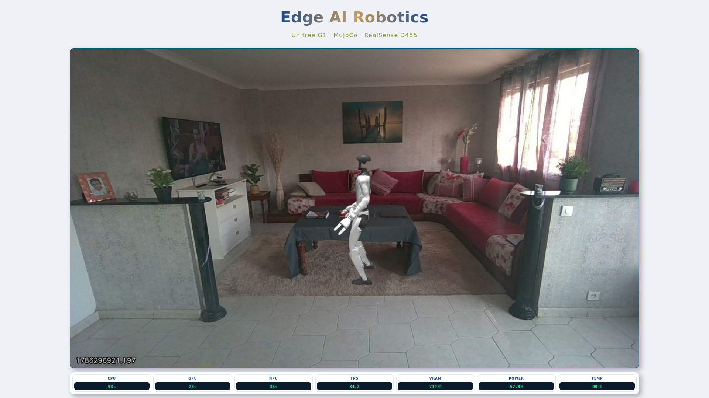
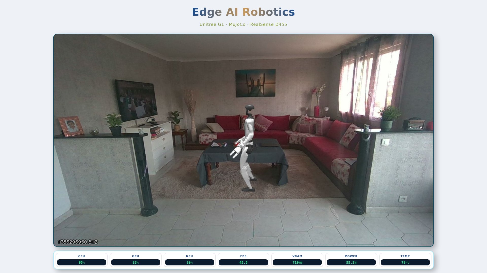

# The web console

Watch the demo from any browser on the LAN, because the machine sits away from
the TV. It serves the compositor's **own** annotated frames — it never renders
anything itself, so the browser and the TV cannot disagree about what is on
screen.

```
compositor ──JPEG on COMPOSITED_FRAME──► web ──MJPEG multipart──► browsers
browsers   ──POST /cmd/<action>──► web ──UI_CMD──► compositor
telemetry  ──PLATFORM──► web ──/platform──► browsers
```

---

## 1. LAN only, no authentication

It binds **`0.0.0.0:8080`** — all interfaces, IPv4 and IPv6 — and the compose
port publish carries no host-IP prefix, so Docker exposes it on every interface
too. Verified:

```
$ ss -ltnp | grep 8080
LISTEN 0 4096   0.0.0.0:8080   0.0.0.0:*
LISTEN 0 4096      [::]:8080      [::]:*
$ curl -o /dev/null -w '%{http_code}' http://192.168.1.19:8080/    # 200
```

**Anyone who can reach the port can watch the camera and drive the overlays.**
There is no login, no token and no TLS. That is acceptable on a demo network and
nowhere else. Do not port-forward it, and do not put it on a network you do not
control. The warning is repeated in the module docstring, in the compose block
and on the page itself, so nobody meets it only once.

## 2. Resolution is a calibration-bearing setting

`STREAM_RES` picks the sensor mode: **`720p` (default)** or **`480p`**. One
place decides — `common/edgebot/camera.py` — because three processes have to
agree and they start separately: `source` opens the sensor, `calibrate` reopens
it to read intrinsics, `compositor` sizes its window and scales the intrinsics.

`fx`, `fy`, `ppx`, `ppy` are pixel quantities in a **particular raster**, and
1280x720 is not an enlarged 640x480 — different aspect, different sensor crop.
So changing `STREAM_RES` invalidates both `config/camera_calibration.json` and
`config/floor_mask.png`, and both must be regenerated:

```bash
make calibrate HEIGHT=<metres>
```

Nothing tries to convert one calibration into the other, because nothing can.
Running with a mismatch is the quiet failure this project fears most — the
picture still composites, the overlay still paints something, and every distance
is wrong — so the compositor checks at startup and says so at ERROR level:

```
CALIBRATION IS STALE: it was taken at 640x480 and STREAM_RES=720p runs the
sensor at 1280x720. ... distances, the floor polygon and the obstacle
footprints are all wrong until you run 'make calibrate HEIGHT=<metres>'
```

**What the move to 720p touched.** The intrinsics reference used to be the
literal `640.0` / `480.0` written into about thirty expressions across the
compositor, the calibration tool and the groundfloor bridge. All of them now
scale from the raster recorded in the calibration itself. Two related defects
fell out of doing this:

- `services/groundfloor/bridge.py` read `calib["fx"]`, but the calibration
  writes those under `calib["intrinsics"]`. Every intrinsic was therefore
  falling back to its hard-coded default — which happened to be the 640x480
  D455 values, so it worked by coincidence and would have published a
  `CameraInfo` describing the wrong lens the moment the sensor changed.
- `RGB_HZ` is 25 against a 30 fps sensor, and the throttle can only publish on
  frame boundaries, so it delivers **15 Hz**, not 25. Unchanged here, but the
  backdrop updates at half the composite rate and that is why.

**YOLO is unaffected.** `detector.py` takes its input size from the model's own
port (`640x640`) and letterboxes whatever frame it is given, aspect preserved.
Confirmed at 720p: `yolo11m-seg.xml compiled for NPU, input 640x640`.

### Proving the sensor really opened 720p

`STREAM_RES=720p` being set proves nothing, and neither does a log line that
echoes the numbers passed to `enable_stream` — it prints the same values whether
or not the device honoured them. The source therefore reads the **active**
profiles back off the pipeline and logs those:

```
source: requested 1280x720@30 colour + depth (scale 0.0010)
RealSense negotiated: colour 1280x720@30 format.bgr8 | depth 1280x720@30 format.z16
colour intrinsics from the SDK: 1280x720 fx=644.5 fy=644.6 ppx=649.3 ppy=359.4
first published pair: colour array (720, 1280, 3), depth array (720, 1280)
```

If either stream comes back at a size other than the one requested, that is
logged at ERROR, because the calibration describes the requested raster.

**The depth line is the one that matters.** `rs.align(rs.stream.color)`
resamples depth onto the colour resolution, so a depth stream opened at 848x480
would still arrive on the bus as 1280x720 and nothing downstream could tell.
The active profile is the only place the true depth stream size is visible;
checking the bus payload cannot substitute for it.

Independent end-to-end confirmation off the bus: the `CAMERA_RGB` JPEG decodes
to `(720, 1280, 3)`, and `CAMERA_DEPTH` carries 1 843 200 bytes = 921 600 uint16
= exactly 1280x720.

### Why this makes recalibration non-negotiable

The SDK's 720p intrinsics are not the 480p ones scaled:

| | 720p, from the SDK | 480p, calibration on disk |
|---|---|---|
| fx / fy | 644.5 / 644.6 | 386.4 / 386.5 |
| ppx / ppy | 649.3 / 359.4 | 325.6 / 239.6 |
| HFOV / VFOV | **89.6° / 58.4°** | **79.3° / 63.7°** |

Scaling the old `fx` by the width ratio 1280/640 = 2.0 gives 772.8. The sensor
actually reports **644.5** — the naive scaling is **+19.9 % wrong**, and the
field of view is 10° *wider* horizontally and 5° *narrower* vertically, because
720p is a different sensor crop rather than an enlargement of 480p.

That is the entire argument for `_intrinsics_reference()` and for the stale-
calibration guard, in numbers: running 720p against the 480p calibration does
not make distances slightly off, it makes them wrong by a fifth.

### Measured cost

Same room, same scene, consecutive runs. `before` is the configuration as it
shipped; the two `STREAM_RES` columns are what ships now.

| | before: 480p, scale 3, 960x720 out | **720p**, scale 2, 1280x720 out | **480p** fallback, scale 2, 640x480 out |
|---|---|---|---|
| composited fps | 30.1 | 29.9 | 30.1 |
| JPEG encode / frame | 2.3 ms | **3.1 ms** | **1.1 ms** |
| compositor frame work, median / p95 | 30.4 / 35.8 ms | 29.2 / 36.4 ms | 31.3 / 34.3 ms |
| compositor container CPU | — | **65.9 %** | **29.7 %** |
| source container CPU | — | 56.2 % | 22.9 % |
| bus total, per subscriber | 8.72 MB/s | **20.65 MB/s** | **7.74 MB/s** |
| ├ `camera.depth` | 5.95 MB/s @ 614 kB | 15.11 MB/s @ 1843 kB | — |
| ├ `compositor.frame` | 2.07 MB/s @ 69 kB | 3.57 MB/s @ 119 kB | — |
| └ `camera.rgb` | 0.61 MB/s @ 41 kB | 1.87 MB/s @ 117 kB | — |
| web latency, median / p95 | 7 / 11 ms | 7 / 12 ms | 6 / 9 ms |

Reproduce with `make bus-rate ARGS="--seconds 25"`, `make web-latency`, and the
compositor's own 30 s log line.

Reading it:

- **The bus is what 720p actually costs**: 2.4x, and almost all of it is raw
  depth at 1.84 MB per message. That is the number to watch, not the frame rate.
- **`RENDER_SCALE` had to drop to 2.** The offscreen buffer is window x scale in
  both dimensions, so cost grows as the square: at 1280x720 a scale of 3 would
  ask for 3840x2160 while the compositor was already spending 30.4 of its 33 ms
  budget at 480p. At 2 the offscreen is 2560x1440 — *fewer* pixels than the
  2880x2160 it used before — which is how the resolution went up while the
  per-frame work did not.
- **Container CPU is the honest load signal here, not frame work.** The
  per-frame figure barely moves across a 3x change in rendered pixels, so it is
  dominated by a fixed synchronisation cost (the readback and the buffer swap)
  rather than by pixel throughput. Compositor CPU going 29.7 % -> 65.9 % is the
  real price.
- **Latency did not move**, which is the useful result: 720p costs bandwidth and
  CPU, not responsiveness.

**When to fall back to 480p:** a congested LAN, or more than two or three
simultaneous viewers. Each viewer costs its own copy of the composited stream —
3.57 MB/s at 720p, about 1.4 at 480p.

## 3. Latency, and which half of it is measured

The compositor burns `time.time()` into the bottom-left of every frame **and**
sends the same value as the part's `X-Stamp` header.

`make web-latency` reads the header and subtracts it from arrival. That covers
JPEG encode -> bus -> web service -> HTTP socket: **median 7 ms, p95 12 ms at
720p**. It does **not** cover the browser's own decode and paint, which is
exactly why the stamp is also in the pixels — photographing a screen next to a
clock is the only way to include them, and that needs a person.

Against the < 300 ms acceptance, the machine-side half leaves 288 ms of margin.

### The bug this depended on

For a while the stream delivered **one frame per client and then went silent**.
The cause was one argument in `common/edgebot/bus.py`:

```python
msgpack.packb(payload, use_single_float=True)
```

A float32 has a 24-bit mantissa, so around a Unix epoch of 1.79e9 its ULP is
**2^31 / 2^24 = 128 seconds**. Every `time.time()` on every topic was being
snapped to a 128 s grid. The stream only writes frames whose stamp differs from
the last one it sent, and the stamp did not change for two minutes at a time.
The same line explains the frame ages that sawtoothed between -64 s and +64 s,
which had been read as container clock skew and was not.

Removing it costs a handful of bytes per message — payloads here are dominated
by JPEG and by raw byte blobs, and `SUITE_CLOUD` packs its points itself
precisely so they never go through msgpack as floats. The stream went from
1 frame per client to **30.1 fps, 2.17 MB/s**, and frame age from -46 s to
0.01 s.

## 4. Header and layout

**Header**, two centred lines stacked above the columns:

- **Edge AI Robotics** — bold, centred, ~2.6rem, and clearly the largest thing
  on the page, with a horizontal gradient painted through the glyphs:
  `linear-gradient(90deg, #1A4B8C 0%, #C99A5B 50%, #1A4B8C 100%)` plus
  `background-clip:text` and `color:transparent`. The element is
  `display:inline-block`: `background-clip:text` on an *inline* box clips to
  the line box rather than the text, and the fill comes out cut at the
  descenders.
- **Unitree G1 · MuJoCo · RealSense D455** — smaller, centred beneath it, light
  letter-spacing, solid olive `#8A9A3B`.

**Three cards** below it: Status left, video centre, Platform right, in a flex
row whose height is whatever the header leaves. One 10 px gutter everywhere —
between the cards and at the left and right edges of the viewport — so the
spacing reads as a single rhythm rather than as an outer frame. The row still
runs to the bottom edge.

Card chrome is a single soft shadow cast down and right,
`6px 6px 14px rgba(0,0,0,0.28)`, over a thin `1px rgba(0,199,253,0.4)` hairline
and a 10 px radius.

The two **gauge panels are deep Intel blue and slightly translucent**,
`linear-gradient(160deg, rgba(0,40,90,.86), rgba(0,74,134,.86))`, with `#BCD6EE`
labels, white values, and Energy Blue `#00C7FD` bars on a
`rgba(255,255,255,0.12)` track. The alpha goes on the gradient stops rather than
on `opacity`, which would fade the text and the bars along with the background.

Those colours are set by **redefining the custom properties** on
`.card.metrics`, not by overriding each rule: the bar fill, the group label and
the sparkline stroke all already read `var(--accent)`, so one declaration moves
all three and there is no second copy of the widget CSS to drift.

**The page background stayed light** — the one colour judgement. The title
gradient ends on `#1A4B8C` at both sides; on a dark navy page those ends sink
into the background and "Edge" and "Robotics" stop being readable while the
copper middle stays bright.

### The video, and the width it cannot have

The intent was "the video drives everything": full remaining height, strict
16:9, width derived as `height x 16/9`. Built exactly that way it measures
perfectly — picture aspect 1.778, bottoms flush at the viewport edge — and it
starves the panels:

| | video | each panel |
|---|---|---|
| height-driven, as first built | 1712x963 | **87 px** |

87 px cannot hold "map cells known" or "package power"; the labels were being
clipped. The arithmetic is unforgiving and it is not a CSS problem: on a
1920x1080 screen, a 16:9 picture at the full 963 px left under the header wants
`963 x 16/9 = 1712 px` of the 1920 available, so the two panels and two gaps
have 208 px between them however they are written.

So the binding constraint was inverted. The panels get a width **band** —
`flex: 0 0 clamp(8.5em, 11%, 16em)`, relative so it holds at any zoom and does
not run away on an ultra-wide display — and the video card takes what is left.

**The card carries the aspect ratio, not the image.** `aspect-ratio: 16/9` on
`.card.view` with the width coming from flex means the card's own height is
`width x 9/16`, so there is no slack inside it and therefore nothing around the
picture: no mat, no letterbox, no white. The card *is* the frame. It is
`align-self:center`, centred in the row rather than stretched, because
stretching is precisely what would put the white back.

The image is `width:100%; height:100%; object-fit:cover`. Cover rather than
contain: the two are already the same aspect so cover crops nothing, but cover
cannot leave a sliver of background on a sub-pixel rounding difference and
contain can.

`width:auto` with `max-width/max-height` was tried first and is wrong: it
refuses to scale the 1280x720 composite **up**, so on a large screen the video
sat at native size in the middle of its card.

**What this costs:** the video card no longer shares a top and bottom edge with
the panels — it is 16:9 and centred, they are full height. That alignment used
to exist only because the card was padded out with white, so removing the white
and keeping the alignment are the same request twice, and the white lost.

### Fitting at any zoom

Browser zoom shrinks the CSS viewport, so a layout that fits at 100 % and
overflows at 150 % was measured in pixels somewhere. What keeps it honest:

- `minmax(0,Nfr)` column tracks rather than `Nfr`, so a column may be **narrower
  than its content** instead of widening the grid past the viewport — the usual
  cause of a scrollbar at high zoom;
- an explicit `grid-template-rows:minmax(0,1fr)`. Without it the row height is
  content-driven, so `max-height:100%` on a card resolves against an indefinite
  height — a circular constraint Chrome settles at **zero**, which measured as a
  2214x0 video before it was caught;
- `min-height:0` on every child, without which a grid or flex child refuses to
  shrink below its content;
- all spacing in `em`, and type in `clamp()` against `vmin`;
- the video card is `align-self:start` with `width:100%; height:auto`, so it
  hugs the 16:9 frame and there is no white letterbox band inside a white card.

**Type sizes and the header's spacing are clamps whose ceiling is the size asked
for**, not flat rem values: `clamp(1.15rem, 3.9vmin, 2.6rem)` for the title,
`clamp(.6rem, 1.5vmin, 1rem)` for the subtitle, `clamp(.25rem, .9vmin, .5rem)`
for the gap under the title and `clamp(.6rem, 2vmin, 1.2rem)` for the header's
bottom padding. A flat rem does not shrink with
the viewport, so at 150 % zoom on a small screen a 2.2rem heading plus a 16:9
video plus two cards is taller than the viewport, and "~2.2rem" and "no
scrollbars at 150 %" would contradict each other. The clamp honours the size
wherever there is room and gives way where there is not.

Verified in headless Chrome at the CSS viewport a 1920x1080 screen presents at
each zoom:

| zoom | CSS viewport | scrollbars | picture (aspect) | video card | panel width |
|---|---|---|---|---|---|
| 50 % | 3840x2160 | none | 3316x1866 (1.778) | 3318x1866 | 240 px |
| 100 % | 1920x1080 | none | 1514x851 (1.778) | 1515x851 | 181 px |
| 150 % | 1280x720 | none | 959x540 (1.778) | 961x540 | 139 px |

Picture and card are the same box to within a pixel at every zoom, which is the
check that there is no white around the video. The panels run to the bottom
edge (gap below the row: 0 px); the video card is centred. Type: title
41.6 / 41.6 / 28.1 px, subtitle 16.0 / 16.0 / 10.8 px.

Header, both panels and the video are each checked **fully inside the viewport
rectangle**; `scrollWidth`/`scrollHeight` are compared with
`clientWidth`/`clientHeight` in both axes; the card tops and bottoms are
reported (equal for the two panels; the video card is centred by design); and the picture's aspect is computed from the element
box (`object-fit:contain` means the box is the card, so the check reports the
picture a viewer actually sees, not the box). At 100 % the title lands at
41.6 px = exactly 2.6rem and the subtitle at exactly 1rem; at 150 % the clamp
gives way, by design.

The check is `scripts/zoom_check.js`, against a running console:

```bash
docker run --rm --user root -e PUPPETEER_CACHE_DIR=/home/pptruser/.cache/puppeteer \
  --network edge-ai-robotics_default -v "$PWD/scripts:/work" -w /work \
  ghcr.io/puppeteer/puppeteer:latest node /work/zoom_check.js http://web:8080/
```




## 5. The monitor strip

The Status panel is gone and the readings sit in a strip **under the video, the
same width as it**, styled after `docs/monitor.png`: one tile per quantity, a
blue uppercase label over a dark inset showing green digits.

| tile | source | note |
|---|---|---|
| CPU | `/proc/stat` | busy %, all threads |
| GPU | qmassa `eng_usage` | max across engines |
| NPU | `npu_busy_time_us` | differenced |
| FPS | the web service | frames arriving per second |
| VRAM | qmassa `mem_info` | **shared system memory** on this iGPU |
| POWER | Intel PCM | package watts |
| TEMP | `coretemp/temp1_input` | package, "Package id 0" |

**FPS is measured at the web service, from arrivals**, not taken from the
compositor's counter — it is the rate this page can actually show. It reads a
few fps under the compositor's own figure (35–37 against 40–43) because some
frames are dropped at the bus high-water mark, and that difference is the
honest part of the number.

**VRAM is shared memory, and the tile says so on hover.** This iGPU reports
`vram_total: 0`; the real figure is `smem_used`, system memory the GT is using.
Both are carried in the payload with a `gpu_mem_shared` flag rather than
quietly calling shared memory VRAM.

A null reading writes an em dash, never a zero, and the collector's own reason
goes on the tile's tooltip — the readout has room for a number and nothing else.

### Same width as the video, at any zoom

The video and the strip are one centred column. The video's **height** is what
is left after the header and the strip, its width follows from 16:9, and the
column is `width:fit-content` — so the column ends up exactly as wide as the
video and the strip's `width:100%` inherits that. Neither element needs to know
the other's number.

`--mon-h` is a length rather than a percentage for the same reason the row
needed an explicit track earlier: `aspect-ratio` can only give a definite width
from a definite height.

| zoom | video | strip | width delta | tiles | scrollbars |
|---|---|---|---|---|---|
| 50 % | 3421x1924 (1.778) | 3421x81 | **0 px** | 7 | none |
| 100 % | 1543x868 (1.778) | 1543x61 | **0 px** | 7 | none |
| 150 % | 1000x563 (1.776) | 1000x49 | **0 px** | 7 | none |

## 6. Saving a frame: Shift+S

**Shift+S** in the compositor window writes what is on screen to
`docs/images/frame-YYYYMMDD-HHMMSS.png`. Plain `s` still toggles the detections
overlay — GLFW reports a physical key rather than a character, so the two are
told apart by the shift modifier, not by case.

What is written is the annotated CPU copy, the same array the window and the
browser show, so the file is what was being looked at, overlays included.

**The timestamp is local time, and that needed a mount.** The container clock is
UTC: it read 17:34 while the host read 19:34 CEST, so every capture would have
been filed two hours early. `/etc/localtime` and `/etc/timezone` are mounted
read-only into the compositor, after which both clocks agree:

```
host      : 19:38:10 CEST
compositor: 19:38:10 CEST
```

`./docs` is mounted so the file lands in the repository. It is written by root,
like everything else the containers produce in `data/`. `SNAPSHOT_DIR` moves it.

## 7. Where the readings come from

### Power: Intel PCM over the MSRs

By the reference's `get_power_usage`: run `pcm 1 -csv -i=1 -nc -silent` for one
interval, find the header row containing `Date,Time`, strip the `1|"..."|`
prefix every line carries, and read the energy columns. Joules measured over one
second **are** watts, so there is no conversion. Counter priority is the
reference's: **Proc + DRAM > System > CPU**. On this board PCM offers
`Proc Energy (Joules)`, `Power Plane 0/1` and `SYSTEM Energy` but no DRAM
column, so Proc is used alone.

**The packaged `pcm` cannot measure this machine.** Debian's 202502-1 exits
rc=1 before touching an MSR:

```
Error: unsupported processor ... CPU family 6 model number 204
Brand: "Intel(R) Core(TM) Ultra X7 358H"
```

Upstream has since added Panther Lake as `PTL = PCM_CPU_FAMILY_MODEL(6, 204)`,
so the image builds PCM from a pinned commit. That is the whole reason for a
source build, and no amount of capability granting substitutes for it.

### GPU: qmassa

`qmassa -x -t <json> -n 2 -m <ms> -d <bdf> --drv-options xe=engines=pmu`, then
the max across `eng_usage` engines — the GPU is busy when any engine is, which
is what xpu-smi and intel_gpu_top mean — plus `act_freq` and `gpu_cur_power`.
Not packaged anywhere (not apt, not crates.io), so it is built from a pinned
upstream commit too.

**Correction to an earlier version of this document:** it stated that iGPU power
is "not exposed by this driver". That was wrong. It is absent from
`/sys/class/hwmon`, which is where the previous collector looked, but qmassa
reports it — measured at **7.9 W** while the demo runs. The only figure on this
board that is genuinely not exposed is **NPU power**: the accel driver publishes
busy time, frequency and memory, and no energy counter.

### The PMU lock

PCM and qmassa both claim hardware PMU counters while initialising, and the
kernel allows one client at a time; whichever starts second fails. They run on
**two separate threads** here — neither is fast enough to sit inside a 1 Hz
loop, PCM taking about 1.3 s and qmassa about 2 s — so a single
`threading.Lock` around the subprocess call is the only thing keeping them
apart. It is not a formality and it is not defensive: remove it and one of the
two starts failing. The lock is released before parsing.

Cheap readings (CPU jiffies, NPU sysfs) stay on the main loop at 1 Hz. Power and
GPU carry whatever the workers last produced, so both ship their own age
(`pkg_w_age`, `gpu_age`) rather than pretending to be instantaneous.

### What the host and the container need

**On the host:** the `msr` kernel module.

```bash
sudo modprobe msr          # and /etc/modules-load.d/msr.conf to persist it
ls /dev/cpu/0/msr          # must exist
```

Without it PCM cannot open an MSR handle and reports so.

**In the image:** the PCM binary carries file capabilities, set at build time as
the reference does.

```dockerfile
RUN setcap cap_sys_rawio,cap_sys_admin,cap_dac_override+ep /usr/local/sbin/pcm
```

**In compose**, each established by removing it and re-testing:

| setting | needed by | symptom without it |
|---|---|---|
| `cap_add: SYS_RAWIO, SYS_ADMIN, DAC_OVERRIDE` | pcm | rc=126, `Operation not permitted` on execve |
| `device_cgroup_rules: 'c 202:* rmw'` | pcm | `EPERM` opening `/dev/cpu/N/msr`, though the node is mounted and visible |
| `security_opt: apparmor=unconfined` | pcm | rc=1 |
| `security_opt: systempaths=unconfined` | pcm | rc=1, `Unsupported mode. NMI watchdog is enabled and Linux perf_event driver is not used` |
| `/dev/cpu:/dev/cpu:rw` | pcm | no MSR nodes |
| `/dev/dri` + `/sys/class/drm:ro` | qmassa | no GPU found |

**qmassa needs none of the capabilities or security options** — measured.

### The NMI watchdog, and a measurement that lied

`systempaths=unconfined` is here for a different reason than it once was. PCM
refuses to start while the kernel's NMI watchdog is enabled and it is not using
the perf_event driver; it turns the watchdog off for the measurement and back on
afterwards, which needs `/proc/sys` **writable**.

An earlier pass concluded this option was unnecessary, and published that. It
was wrong, and the way it was wrong is worth recording: the test ran shortly
after a PCM invocation that had been killed mid-sample, leaving
`kernel.nmi_watchdog` at 0 on the host. PCM then found nothing to change and
succeeded without needing to write anything. **The measurement was reading
leftover host state, not the configuration under test.** It surfaced later as
`package power —` on the panel with the host back at `nmi_watchdog = 1`.

`PCM_USE_PERF=1`, which should route PCM through perf_event and sidestep the
watchdog entirely, does **not** work here — same denial. Tested.

**A less permissive alternative, not verified here** because it needs root on
the host: set `kernel.nmi_watchdog=0` once, persistently. PCM would then find it
already off and have nothing to write, and `systempaths=unconfined` could come
out. Worth doing if someone can test it — as it stands PCM toggles a host-wide
kernel setting on every sample, twice per `PMU_PERIOD`.

A file capability can only grant what the container's **bounding** set already
contains, which is why `setcap` alone is not enough and `cap_add` alone would
be. Both are kept: the setcap so the binary carries its own requirement, the
cap_add so the bounding set permits it.

This is scoped to the `telemetry` container, which is why telemetry is **not**
part of the `web` service. The console is LAN-facing and unauthenticated;
giving it `SYS_RAWIO` and MSR access to save a container would be trading the
one thing worth protecting for nothing.

### Missing is rendered as missing

Every figure is a number or `null`, and `null` never renders as 0 — the row
shows an em dash and a zero-width bar. Two reasons are kept apart because they
are different problems:

- **"not exposed by this driver"** — a fact about the hardware. On this board:
  NPU power, and nothing else.
- **"blocked by the container runtime"** — a fact about how we launched, and
  fixable in compose. This is what appears if the caps, the cgroup rule or the
  AppArmor option are removed.

### Measured

Live during the demo at 720p: CPU 91 %, package **55.4 W**, GPU 23.6 % at
2500 MHz drawing **7.3 W**, NPU 34.9 % at 950-1050 MHz, 134 MB.

The panel tracks real change. Stopping and restarting `perception` — the
service that holds ~1400 % CPU and owns the NPU — gives a clean step:

| | CPU % | package W | GPU % | GPU W | NPU % |
|---|---|---|---|---|---|
| demo running | 91.4 | 55.4 | 23.6 | 7.3 | 34.9 |
| perception stopped | **17.2** | **25.4** | 24.4 | 6.4 | **1.4** |
| restarted | 90.9 | 56.0 | 24.0 | 7.5 | 34.8 |

GPU busy barely moves across that step, correctly: the compositor keeps
rendering whether or not anything is being detected.

**Starting the three suite bricks moves the panel very little** — CPU 91.4 to
90.7, package 55.4 W to 54.4 W. That is not the panel being inert, it is the
board being saturated: `perception` alone already holds the CPU at ~91 %, so
extra work is redistributed rather than added. Worth knowing before reading a
flat gauge as a broken one.

The collector costs **0.1 % CPU and 9.6 MB**, PMU tools included.

## 8. Overlays: keyboard only

The on-page overlay panel is gone. `f` floor, `s` detections, `p` suite cloud,
`m` map and `r` reset still work **at the machine**, unchanged.

The `POST /cmd/<action>` endpoint is deliberately kept even though no button
calls it: it is how a scripted capture drives the overlays without a keyboard,
which is how the figures in `docs/images/` are made. It publishes `UI_CMD`,
which carries an **action, never a state**, so the compositor remains the single
owner of what is displayed.

## 9. X is still required — for rendering, not for viewing

`DISPLAY_MODE` is `web`, `glfw` or `both` (default `both`).

`web` skips **presenting**, not the window. The GLFW window carries the GL
context MuJoCo renders through, and this driver refuses to make a context
current on an unmapped X11 drawable, which would turn every GL call into a
no-op. EGL is not an option here either — it fails with a `gladLoadGL` error, as
recorded in `CLAUDE.md`.

So the X session and `xhost +local:root` remain necessary even when nobody is
looking at the machine. That is a deviation from "web mode has no window" and it
is deliberate.
